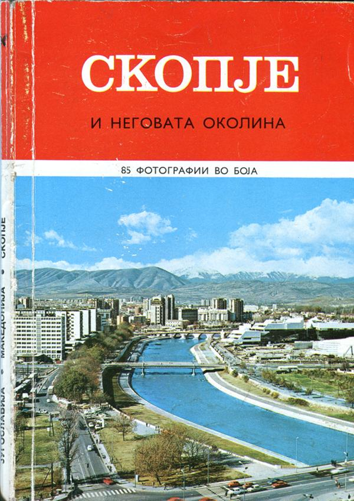

# СКОПЈЕ и неговата околина

„[СКОПЈЕ и неговата околина](skopje-i-negovata-okolina.md)“ е една од позначајните монографии за главниот град на Република Македонија. Го опишува животот во градот од неговото настанување, па сѐ до осумдесеттите години на минатиот век, кратко пред да започне мачниот период на распаѓањето на Југославија.

Книгата, со текст подготвен од Оливера Ѓекиќ, содржи бројни историски настани што не се евидентирани никаде на Интернет на македонски јазик и претставува печат на едно подзаборавено време, кога во главниот град на Република Македонија се живееше, а не се преживуваше.

ГОЛЕМО благодарам до г-ѓа **Оливера Ѓекиќ** за нејзиниот бесценет труд и до сите други луѓе што учествувале во подготовката на ова издание. Со објавувањето на содржината на книгата немам намера да нанесам штета на нејзината интелектуална работа, која бескрајно ја почитувам. Намерата ми е да ја направам книгата подостапна, бидејќи сметам дека е вредно културно наследство на Република Македонија што треба да е достапно во дигитален формат.

За жал, _недостасуваат 85-те фотографии во боја_, бидејќи беа извадени од копијата на книгата што успеав да ја најдам. Ако имате сочувана копија со слики што можете да ми ја позајмите, ве молам [да ми пишете](mailto:goce.mitevski@gmail.com).

Скенирањето е направено полуавтоматски, со помош на „[Tesseract Open Source OCR Engine](https://github.com/tesseract-ocr/tesseract)“ и можно е некаде да има печатни грешки. Доколку забележите некоја грешка, [можете да ја пријавите](https://github.com/gocemitevski/skopje-i-negovata-okolina/issues/new) на GitHub, за што однапред ви благодарам.

-- Гоце Митевски

---

[ЗАПОЧНЕТЕ СО ЧИТАЊЕ](skopje-i-negovata-okolina.md)
