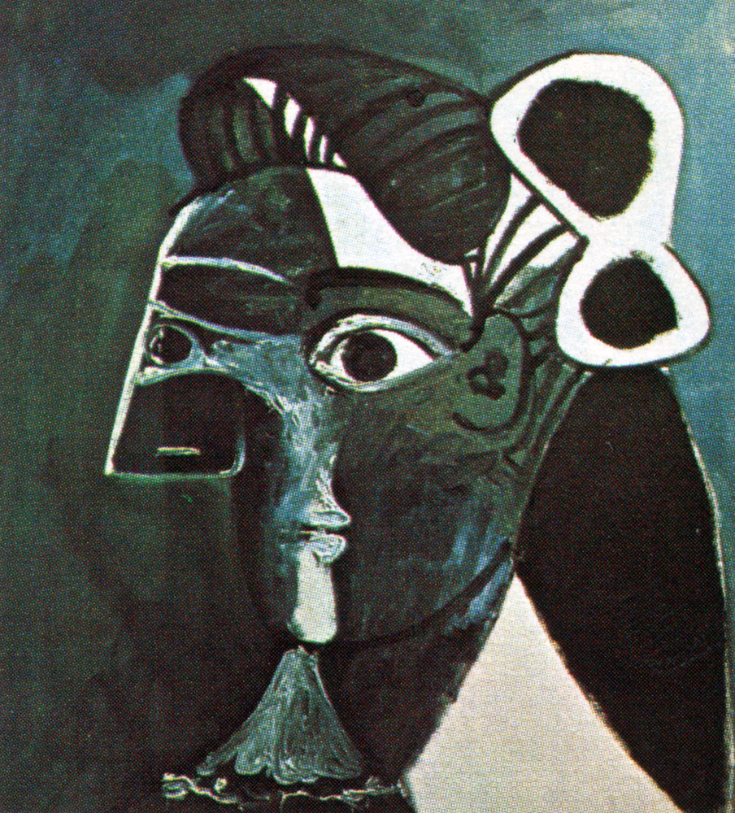
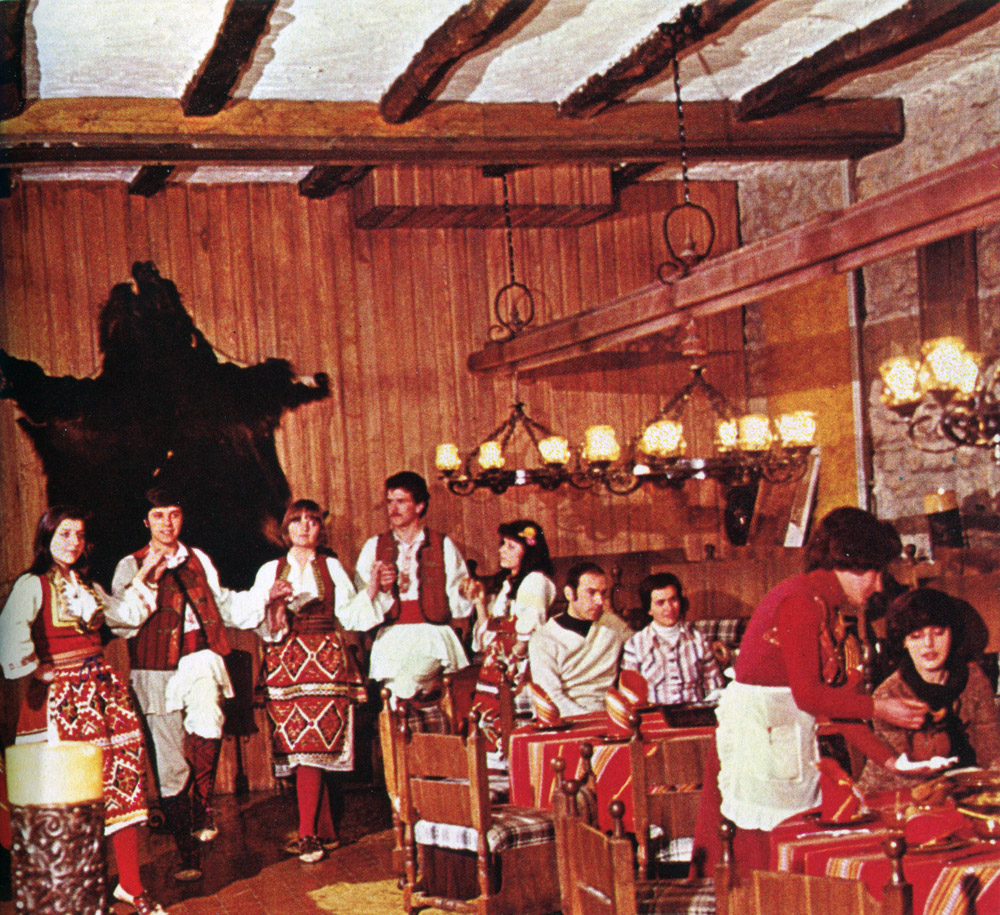
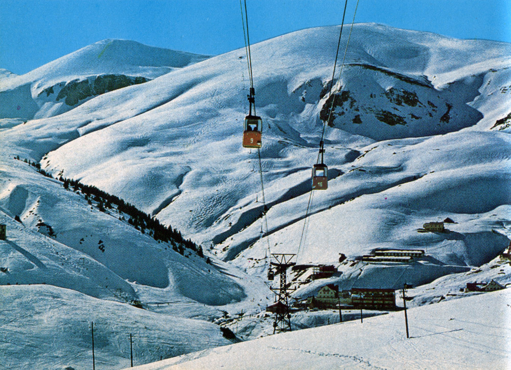

[НАЗАД](README.md)

---

# СКОПЈЕ и неговата околина

БИБЛИОТЕКА НА МАЛИ ТУРИСТИЧКИ МОНОГРАФИИ

БРОЈ 64

YU ISBN 86-7133-012-5

## УРЕДУВАЧКИ ОДБОР

* Ристо Дуковски
* Ѓорѓи Доневски
* Коста Балабанов
* Александар Стојмилов
* Михајло Булуков
* Душко Кузмановски
* Ана Ивеља-Далматин

## УРЕДНИЦИ

* Душко Кузмановски
* Катарина Милановиќ

## ЛИКОВНА ОПРЕМА

* »Turistkomerc«, Загреб

## КОРЕКТОР

* Миле Маслаќ

## 3А ИЗДАВАЧОТ

* Ѓорѓи Доневски
* Павле Никшиќ

# СКОПЈЕ И НЕГОВАТА ОКОЛИНА

## ЈАЗИЧНА РЕДАКЦИЈА

* Евтим Манев

## ТЕКСТОТ ГО ПОДГОТВИ

* Оливера Ѓекиќ

## РЕЦЕНЗЕНТИ

* Кузман Георгиевски
* Александар Карев
* Орде Иваноски

## СНИМАТЕЛИ

* Киро Билбиловски
* Милан Петровиќ
* Румен Камилов
* Архив на »Turistkomerc«

Copyright by »Turistkomerc«

Сите права ги задржуваат издавачите

## ИЗДАВАЧИ

* Туристички сојуз на Скопје, Скопје Градски ѕид, блок III
* »Turistkomerc«, Загреб Илица 26/I Загреб 1986

> СКОПЈЕ ДОЖИВЕА НЕВИДЕНА КАТАСТРОФА, НО СКОПЈЕ ПОВТОРНО ЌЕ ГО ИЗГРАДИМЕ СО ПОМОШТА НА ЦЕПАТА ЗАЕДНИЦА, ТОА ЌЕ СТАНЕ ГОРДОСТ И СИМБОП НА БРАТСТВОТО И ЕДИНСТВОТО, НА ЈУГОСЛОВЕНСКАТА И СВЕТСКАТА СОПИДАРНОСТ.

ТИТО СКОПЈЕ, 
27 ЈУЛИ 1963 ГОДИНА

Од дамнешни времиња Македонија е крстосница на важни патишта, на разни цивилизации и религии. Со векови низ неа минувале и повеќе освојувачи. Тоа се одразувало врз културата и обичаите, врз духот на македонскиот народ, кој секогаш се борел за опстанок, за слобода и посветол ден.

Социјалистичка Република Македонија е најјужна република на југословенската федерација, со простор од 25.713 км2, што е десетти дел од површината на Југославија, и во неа живеат околу два милиона жители. Скопје е главен административен, политички и културен центар на Социјалистичка Република Македонија.  Оваа земја обилува со вонреден и питорескен релјеф. Тоа е разновиден и богат мозаик од природни убавини, што како скапоцен килим се распостила пред погледот.

Повеќе убави планини ја создаваат нејзината почва, правејќи своевиден колаж од високи сртови и врвови, што потоа се спуштаат во зелени котлини и долини. Може да се набројат планини чии врвови се повисоки од две илјади метри, исполнети со места погодни за одмор, рекреација и спортување.  Тоа се белоснежната убавица Шар Планина, овековечена во бројни народни песни и легенди, недостапниот Кораб, Пелистер како национален парк, потоа зелената Бистра и Галичица, а на исток Плачковица, Беласица, Осоговските и Малешевските Планини и др.

Македонија има раскошно и топло сонце и чудесно сино небо.  Високите температури не се исклучок, зашто летата и есените се долги, а зимите благи, со снегови по планините. Климата овозможува плодородност на секоја педа обработлива земја, како и можности за летна и зимска рекреација и други активности. Воздухот е чист, свеж, без големи примеси на смог и загаденост. Просечната годишна температура е 14,5ºC, што е една од потоплите области на Југославија. Реките се релативно мали, но бистри и бујни, полни со разновидни риби.  Вардар е најголемата река, во должина од околу четиристотини километри. Изворот на Вардар се наоѓа близу до селото Вруток, во подножјето на Шар Планина, недалеку од Гостивар.  Реката тече низ Скопската котлина, минува низ Скопје, го дели градот на два дела и ce спушта кон Титов Велес, град богат со историски знаменитости, минува крај античкиот град Стоби и оди кон Солун, за да се влее во Егејското Море. Во нејзиниот тек се придржуваат и неколку помали реки — Треска, Лепенец, Пчиња, Брегалница и Црна Река.  Присуството на овој значаен енергетски потенцијал, заедно со другите реки, не значи само можност за милијарди киловат- часови произведена енергија, туку и обилство води за наводнување, како и посредно влијание врз климата на македонското поднебје. Пловните можности на Вардар во минатото ги ползувале бројни, вешти сплавари по должината на целиот тек, од Скопје до Солун. За оваа река е сврзан и еден од проектите на Обединетите нации, чија реализација не е далечна иднина — сливот на Вардар да се оспособи за речна пловидба до Солун, а преку слични зафати на реката Морава во Социјалистичка Република Србија, во рамките на истиот проект, да се достигне Дунав, а тоа ќе значи и воден пат кон Средна и Северна Европа.

Оваа река-немирница отсекогаш настојувала да ги препее сопствените брегови, а потоа како секавица да се втурне низ Скопје и сѐ да понесе. Таква беше и големата стихијна поплава на Скопје во 1962 година, предвесник на катастрофалниот земјотрес што стана една година подоцна. Меѓутоа, вековите го имаат многукратно испишано името на оваа река во историјата на македонскиот народ. Жив сведок за тоа се бројните народни песни во кои се воспева Вардар.

Хидрографијата на Македонија ја дополнуваат и трите надалеку познати тектонски езера: Охридското, Преспанското и Дојранското, како и повеќе вештачки и акумулациони езера, формирани последниве децении.  Езерото крај Охрид, градот на древната словенска писменост спаѓа меѓу најстарите во светот. Начинот на неговото настанување во дамнешните геолошки формации, како и неговиот зачуван реликтен животински свет, е сличен со флората и фауната на езерата Бајкал, Тангањика и Њаса.  Езерото се синее на површина од 348 км2 во должина од 30 и широчина од 15 км, како небеска солза падната меѓу витите планини.

Преспанско Езеро, сѐ уште недоволно освоено од туристите, е на надморска висина од 853 м и зафаќа површина 294 км2, што се наоѓа меѓу, плодното Ресенско поле и високите околни планини.

Дојранско Езеро, голем и богат рибарник, се протега на површина од 43 км2. Тука риболовот е единствен во Европа: се лови со птици, како пред неколку милениуми.

## ГЕОГРАФИЈА НА ГРАДОТ

Скопје има исклучителна местоположба. Всушност, тоа е средишнина на Балканскиот Полуостров. Распослан со своите погодни правци на сите страни, градот претставувал и претставува јазол на секакви сообраќајни врски со светот околу него.

Скопје лежи на меридијанот што минува крај Моравско- вардарската долина. Токму тука минува автопатот »Братство- единство«, кој сѐ повеќе се модернизира. Тој Скопје го приближи со Белград (440 км) и со Европа, односно Солун, Солунскиот Залив (250 км) и Источниот Медитеран.  Кон овој 'рбетник се надоврзуваат и многу други комуникации што стасуваат или минуваат низ градот. Совладувајќи ја Качаничката Клисура, патот се отвора кон Социјалистичка Автономна Покраина Косово, а пак преку неа се добива прикпучок со синото и прекрасно Јадранско Море. Магистралниот пат продолжува од Скопје, а минува преку Приштина, Титова Митровица, Рожај и Титоград, односно Црногорското Приморје, така што го приближува Скопје само на 400 км од чудесните приморски пејзажи.

Ваквата положба му обезбедува значење и важност на градот, не само во сегашниот миг, туку и од перспективите на неговата иднина. Впрочем, Скопје отсекогаш претставувало своевиден административен, културен, политички и сообраќаен центар.

Стратешката позиција на неговата географска положба била Одамна забележана во мапите на различни освојувачи, кои преку оваа котлина и овој град ги протегале своите освојувачки апетити понатаму, кон Егејот и Блискиот Исток, но и во обратен правец, кон север.  Скопје го надвисува морето само за 245 м. Преку источниот излез на котлината е сврзано со Овче Поле (покрај Пелагонија, втората житница на СР Македонија) - и Кумановско-прешовската долина. Од друга страна, градот е заобиколен со неколку планини и како да се притаил во спокојот на нивната заветрина. Јужната природна меѓа на градот ја сочинува планината Водно, со врвот Крстовар (1.066 м), која натаму се протега кон планинскиот венец Јакупица — Караџица, со најголемата висина кај врвот Солунска Глава (2.540 м), од каде што се гледа Егејското Море. На југозапад, Скопската котлина, со еден свој дел, се протега дури до планините Осој (1.506 м) и Жеден (1.260 м), за да погледне кон белите врвови на Шар Планина. Северната страна на градот ја штити Скопска Црна Гора, со највисокиот врв Рамно (1.561 м), на чии пристапни падини никнуваат сѐ повеќе излетнички куќи.  Ваквата природна положба како да не му дозволува на градот никаков излез, но тоа е привид, зашто преку Таорската, Жеденската и Качаничката Клисура се отвораат патните хоризонти на Скопје во сите правци.

## КОМУНИКАЦИСКИ МОЖНОСТИ

Целиот свој растеж низ вековите градот го должи токму на ваквата своја благопријатна положба — на патен јазол и крстосница. Таквиот свој статус градот подеднакво го уживал и во времето на Дарданите, на античките Македонци и на Римјаните, како и подоцна — со доаѓањето на Словените, или уште подоцна — со потпаѓањето под Турците. Сепак, престижот на градот како сообраќаен центар најмногу нараснува за време на Наполеон, во почетокот на XIX в. Поради економската блокада во Европа, Наполеон бил принуден да бара други патишта и земји со кои ќе тргува и ќе се снабдува.  Наоѓајќи свои нови трговски партнери во земјите од Средниот Исток, Наполеон го открива патот низ Скопје како најкус и најцелисходен.

Бескрајни, шаренолики кервани, натоварени со најразлични стоки, минувале низ оваа копнена врска на Блискиот Исток со Европа. Патот минувал низ Струмица, Велес и Скопје. Оваа комуникација историјата ја памети како »Бел пат«, поради памукот што бил пренесуван од Исток за потребите на француското царство. Од своја страна, тоа придонело за брзиот економски растеж на Скопје, каде што се среќавале трговци од многу земји. Во овој период бил забележан и вистински занаетчиски бум во градот на Вардар. Занаетчиството и натаму ќе досега нови височнии, независно од кратковечноста на европската блокада, а со тоа и на »Белиот пат«.  Традицијата на железничкиот сообраќај е стара повеќе од сто години. Од 1873 година, кога била изградена првата пруга од Солун преку Скопје до сегашна Титова Митровица, сѐ до денешни дни, овој вид сообраќај доживува постојана експанзија.  Годишниот промет што се остварува на железничката станица во Скопје надминува милион патници, а количеството на стоката што пристигнува или го напушта градот изнесува речиси три милиони тони. Во источниот дел на градот забрзано се изведуваат завршните работи на новиот комуникационен и транспортен центар, во чиј состав влегуваат новата железничка станица, новата автобуска станица и телекомуникациониот центар. Овој комплекс, според проектот на јапонскиот архитект Кензо Танге, претставува оригинално решение на еден современ сообраќаен јазол. Со тоа само се продолжува традицијата на градот, зашто и пред земјотресот од 1963 г. Скопје ја имаше најубавата железничка станица во Југославија, а за многумина и на Балканот.

Сегашната автобуска станица се наоѓа на левата страна од реката Вардар, речиси на самиот влез во Старата чаршија.  Овој вид сообраќај постојано го зголемува својот промет, превезувајќи патници, па така на автобуската станица дневно пристигнуваат стотина автобуси од сите краишта на СР Македонија, Југославија и од странство, со неколку илјади патници. Новата автобуска станица, во склопот на современиот сообраќаен и транспортен центар, само ќе го зголеми прометот на патниците и ќе овозможи негова натамошна модернизанција.

На источната страна, дваесетина километри од градот, кај селото Петровец се наоѓа истоименото скопско воздушно пристаниште, од каде најбргу се стигнува во Белград, Загреб, Љубљана, Дубровник, Сараево, Титоград и натаму со другите делови на светот. Опремен со современа контролна техника и широка писта, аеродромот е оспособен за прифаќање и на најсовремени воздухопловни џинови. Динамиката на современото живеење cѐ повеќе го интензивира воздушниот сообраќај.

## НАСЕЛЕНИЕ

Населението на Скопје е во постојан пораст. Доведувајќи ги современите демографи во недоумица, тоа и натаму бележи своевидни рекорди. Ако ја погледнеме демографската линија наназад, не ќе стасаме многу далеку, зашто подалечната историја на градот не ни оставила податоци за бројноста на неговото население. Првата таква проценка за бројноста на населението ја сретнуваме во белешките на знаменитиот средновековен патописец Евлија Челебија, каде што се зборува за состојбата во градот по големиот пожар од 1689 г.  Притоа, овој турски автор наброил повеќе градски квартови со околу 60.000 жители.

Тоа се податоци од Евлија Челебија собрани при крајот на XVII в., а првиот нареден податок веќе се однесува за ХХ в.  Имено, за годината 1921 се зборува дека населението на Скопје забележало извесно намалување, пред сѐ поради војните што минале преку него. Градот имал само 40.660 жители. Меѓутоа, само по десет години веќе го достигнува нивото Од 68.334 жители. Оваа бројка претрпува извесни промени во годините пред и за време на Втората светска војна. Веднаш по ослободувањето, доаѓа до првата демографска експанзија, кога бројот на жителите рапидно расте и веќе во 1948 г. изнесува 87.654, односно 119.132 во 1953 г. Пописот од 1961 г. покажува нов рекорд од 180.943 жители.  Катастрофалниот земјотрес од 1963 г. не предизвика сериозни опаѓања во бројноста на населението. Напротив, со живата миграција и урбанизација, градот доживува невиден демографски растеж. Шест години по трагичниот настан, во 1969 г.  градот веќе брои 373.919 жители.

Според податоците од 1984 г. во Скопје, на површина од 1.840 км2, во 126 населби живеат повеќе од 535.000 жители. И тоа не е сѐ. Експертите веруваат дека постојаниот економски развој на градот и во иднина ќе значи причина за значителни демографски промени.

Во етнички поглед, градот е шаренило од повеќе народности кои, во заедничко живеење и секојдневна упатеност еден кон друг, на најдобар начин го искажуваат духот на братството и единството, на рамноправноста меѓу сите граѓани. Во Скопје, покрај Македонци и припадници на другите југословенски народи, живеат Албанци, Турци, Роми, Власи, Ерменци и др.

## СТОПАНСКИ ПОТЕНЦИЈАЛ

Стопанството е сфера од општествениот живот што најмногу и најречито го илустрира растежот на градот и го одделува од минатите времиња, кога Скопје многупати го губело престижот на економски и политички центар, токму поради недостигот на каква било стопанска активност. Денес стопанството е една од неговите најдоминантни карактеристики. Одлика што го идентификува и го прави најголем стопански центар во Републиката. Состојбата од 1984 г. покажува околу 170.000 вработени.

Последната војна го остави градот само со неколку безначајни работилници и помали фабрики, во крајно неповолна стопанска положба. Денес е потребна, бездруго, голема трпеливост за да се набројат сите поголеми и помали индустриски објекти.  Да ги споменеме најважните: Рудници и Железарница »Скопје«, лоцирана на самиот влез од градот, на неговата североисточна страна. Овој металуршки гигант веќе произведува суров челик, лим од различни профили и низа други производи и конструкции.  Органско-хемиската индустрија »ОХИС« е расположена на едно пространо, широко плато од левата страна на патот што води кон селото и кон приградската населба Драчево. Овој хемиски гигант произведува синтетички малон-влакна, синтетички топли подови и покривен материјал, скај, детергенти, пестициди и др.

Во редот на стопанските објекти од неодамна се вклучи уште еден вонредно значаен објект. Во 1976 г. беше пуштена во погон фабриката за полиетиленско влакно и филамент »Хемтекс«.

Во индустриската зона се поместени металскиот завод »Тито«, фабриката за цемент »Усје«, фабриката за стакло и стаклена волна, фабриката за автобуси »11 Октомври« со околу 2.000 автобуси годишно производство, конзервната индустрија »Вардар — Конзерваекспорт«, »Алкалоид« — фабрика за производство на лекови и козметика, фабриката за бонбони и чоколади »Европа«, за кожа и туткал »Гоце Делчев«, фабриката за конфекција »Прогрес«, фабриката за чорапи и трикотажа »Црвена звезда«, фабриката за чевли »Газела«, Тутунскиот комбинат »Скопје«, Фабриката за пиво и слад, Индустриската кланица, комбинатот за производство на конфекција и cnopтски реквизити »Македонија-спорт«, фабриката за мебел и дрвена граѓа »Треска«, фабриката за алуминиумски преработки, конструкции и профили »Алумина«, фабриката за станови од готови елементи »Карпош« и др. Веќе се изгради и комплекс на петрохемиската индустрија на приодот кон Скопје.  Во близината на Скопје, на седумнаесеттиот километар на патот Скопје — Тетово, се наоѓа хидроцентрапата »Матка«.  Ваквата индустриска база претполага претходно постоење на развиено разновидно занаетчиство. Токму тоа било вековното обележје на Скопје. Вековите одминувале, а скопските занаети го ширеле својот спектар и претставувале стопанска дејност и му давале шарм на градот. Меѓутоа, модерниот живот постепено го уништува занаетчиството. Затоа денес недостигаат многу неповратно загубени дуќанчиња, а со нив и мнозина самоуки народни уметници, што со алатка, чекан и шило го збогатувале секојдневјето. На времето опстојуваат жилаво и упорно само десетина занаети, без кои, веројатно, не се може: кујунџискиот, ковачкиот, казанџискиот, свеќарскиот, папуџискиот, качарскиот, металостругарскиот и други занаети.

Старата чаршија од левата страна на Вардар и денес има повеќе од илјада занаетчиски дуќани. Навистина, оваа чаршија ја губи својата патина, но и со новите дуќани, со целокупната своја интересна архитектурна целина, го доловува минатото на Скопје.

Ако занаетот претставува атракција, земјоделството и грижата околу него претставуваат дејност од првостепен приоритет.  Скопско поле најмногу овозможува одгледување на зеленчук, овошје и лозови насади.  Трговијата е значајна составка во стопанската структура на градот. Впрочем, градот отсекогаш важел за големо снабдувачко место. Неколкуте големи извозно-увозни организации на здружен труд, како »Интеримпекс«, »Технометал-Вардар«, »Макотекс«, »Интекс«, како и неколкуте банки во градот, јасно зборуваат за него како за своевиден трговски центар. Во него се одвива трговија на големо преку спомнатите организации и преку саеми што се одржуваат секоја година во Скопје.  Тоа се саемот на индустриски стоки за широка потрошувачка »CKOMECA«, Саемот за тутун и машини, Саемот за метали и неметали и Саемот за медицинска опрема. Трговијата на мало е организирана во повеќе од 1.600 продавници.

Во Скопје, покрај целосно модернизирање на трговската мрежа, изграден е објект, единствен од таков вид во Југославије. Тоа е Трговскиот центар, сместен во строгиот центар на градот.

Угостителството ја остварува својата услужна функција во преку 33 сместувачки објекти. Дванаесет од нив се модерни хотели, меѓу кои четири од висока категорија, три мотели и повеќе ресторани, сѐ со домашни специјалитети. Хотелите »Континентал«, »Панорама«, »Скопје«, »Олимписко село« се најрепрезентативните сместувачки капацитети. Особено внимание заслужува комплексот »Олимписко село«,подигнат на една блага падина на планината Водно, за потребите на ХХ шаховска олимпијада, која се одржа во Скопје, во 1972 година.  Сето ова, заедно со туристичките и рекреативните можности на градот, ја дополнува неговата туристичка карта и го прави престојот во него занимлив и пријатен. Впрочем, за интересот на туристите во Скопје поречито зборува податокот според кој во 1984 во градот престојувале околу 450.000 туристи. Од нив преку 130.000 биле гости од странство.

## ГРАДОТ НИЗ ВЕКОВИ

Скопје е град со богато историско минато стар околу две илјади години. Најстари историски податоци за градот ни оставил старогрчкиот географ Птоломеј во III в. пред н.е. Во неговиот летопис стои: »Градот Скупи лежи на устието на реката Лепенец во реката Вардар«. На три километри северозападно од Скопје, археолозите открија остатоци од објекти кои му припаѓаат на старото Скупи. Овој локалитет денес се наоѓа во селото Злокуќани.

Градот Скупи, според археолозите, историчарите и историчарите на уметноста, во најстаро време бил заземен од Трибалите, а од крајот на IV в. пред н.е. нив го покоруваат Дарданците кои тука ќе останат до доаѓањето на Римјаните.  Дарданците и припаѓаат кон илирската племенска заедница со силни тракиси елементи. Познато е дека Дарданците живееле на подрачјето на Косово, јужна Србија и северна Македонија (Ниш, Скопје, Куршумлиска Бања). Со римското освојување се приклучени кон провинцијата Мезија, но ги зачувале говорно-етничките карактеристики.  Со доаѓањето на Римјаните на Балканот (кон 148 г. пред н.е.) и Скупи потпаднало под нивна власт. Оттогаш почнува расцутот на Скупи, не само како стопански, стратешки и културен центар, туку и како верско седиште, во кое многу бргу се раширило христијанството. Скупи се развива во голем верски центар со сопствена епископија.

Подоцна, зачестените напади на варварските племиње не се и единствените неволји на овој град. Во 518 г. бил забележан катастрофален земјотрес. Сведочењето на Комес Марцелиниус, во записот »Хроника«, говори за невидени разурнувања на градот.

»...3a миг се разурнати до темел дваесет и четири градови.  Скупи, престолнината на Дарданија, е сосем уништено, небаре низ него минал најстрашниот освојувач. Земјата се распукна во должина на триесет милји и ширина од дванаест стапки, од каде избиваше водена пареа«, запишал хроничарот.  Така неповратно пропаднал убавиот град, во кој, покрај извонредни архитектурни градби, имало повеќе јавни бањи храмови и прекрасен амфитеатар.

По оваа катастрофа, Скупи веќе не се споменува. Скопската котлина добила еден нов градски центар во Јустинијаново време.

Археолошките наоди зборуваат за следното: над урнатините на Скупи животот продолжил и за време на Јустинијан I, траги од VI век има само во североисточниот дел од некогашниот римски град.  Времето на Јустинијан е време на масовно доаѓање на Словени во овие краишта. За одбрана од словенските племиња, на падините на планината Водно на источниот дел бил подигнат кастел Чрни — доцноримско време.

Со незадржливото надирање на бројните словенски племиња, во 695 г. словенското племе Берегезити го освојува градот и така го добива и денешното име Скопје. Затекнатото домородно население било уништено или прогонето, а негов помал дел постепено асимилиран. Истово племе подоцна било признато за суверен на територијата од Скопје до Охрид. Во следните три столетија не останале никакви пишани траги за судбината на градот.

Крајот на првиот милениум од нашата ера бил во знакот на доминација на првата македонска држава и на македонскиот цар Самоил (976—1014), чие царство се протегало на поголем дел од Балканот. Во времето на македонското царство била формирана и Охридската архиепископија, што ќе одигра значајна улога во зачувувањето на самобитноста на македонскиот народ. Во тој период, X—XI век, градот и натаму се развивал. Во Самоиловото царство скопските трговци воспоставиле трговски врски со соседните градови и на југ и на север, со Далмација, како и одделни градови од јадранскиот брег. Скопје ни малку не изгубило од својот престиж, и покрај фактот дека тогаш не било ниту престолнина, ниту административен центар. Во времето на Самоил заповедник на Скопје бил Роман, кој бил вратен од Константинопол, и, подоцна, не останал доследен, туку по решавачката битка меѓу византиските и Самоиловите војски, извршил предавство, препуштајќи го Скопје во рацете на византискиот император Василиј II.  Трагичниот крај на Самоила по битката на Беласица (1014), одново донел тежок живот за градот на Вардар. Падот на македонското царство, сепак, донел нешто ново — одново Скопје станало важен стратегиски центар, добивајќи најразлични »титупи«.  Населението од овие краишта безбројпати се обидувало својот непомирлив однос спрема поробувачите да го искаже со оружје в рака. Така, во 1040 г. избувнува познатото востание на Петар Делјан, внук на царот Самоил. Тој доблесно се бори за Скопје и Македонија; притоа, дури успева и да го поврати градот, но само за кратко време. Натаму, Ѓорѓи Војтех во 1072 r. бил следниот востаник што му донел слобода на градот, но и овојпат само за кратко.

Во 1081 г. Скопје ги менува своите владетели. Норманите стигнале дотука преку Драч, го нападнале и ограбиле Скопје.  Предводени од Роберт Гвискар, Норманите владееле во градот седум години. Во 1093 г. српскиот жупан Вукан само за момент ја прекинал норманската доминација, кога норманскиот херцог Бемунд Таренски повторно ја потчинил целата Полошка котлина, вклучувајќи го тука и Скопје.

По него, низ улиците на градот, за еден релативно краток период минале мнозина освојувачи. Бугарскиот цар Калојан е првиот од низата краткотрајни владетели (1204). Три години подоцна знамето на господарот на Просек, Добромир Стрез се виорело над градот сѐ до 1215 г. А по него повторно Бугари, Византијци, Срби.  Судбината на Скопје била слична со судбината на Македонија: да паѓа од раце в раце на најразлични владетели. Тоа е и причина што градот заостанал во својот растеж. Градбената активност е послаба, а животот притаен во страв од освојувачите.  Сепак, пратеникот на византискиот дворец Теодор Матохит во 1299 г. за Скопје запишал: »Под градската тврдина има и предградие со најубава соборна црква што ја видов во овие краишта«.

Уште еднаш во својата богата историја, Скопје ги менува господарите и станува престолнина, овојпат на моќната српска држава на Душан Стефан, кој тука е крунисан во 1346 г. Овој настан, како и наредниот од 1349 г., кога во Скопје бил прогласен Душановиот законик, кој регулирал најразлични аспекти од јавниот и општествениот живот, мошне придонел градот да стекне исклучителна важност, не само како политички центар, туку и како културно средиште и трговско свратиште. Најголемите трговци на тоа време, Венецијанците и Дубровчаните, имале свои просторни складишта и магацини, а долги кервани запирале на починка, снабдувајќи го градот со стоки од најразлични краишта на светот.

Во 1392 г. Скопје потпаѓа под османлиска власт.  Во изворите за историјата на градот стои дека во манастирот Св. Тодор било испишано од раката на непознат монах: »В лето 69 сатно... к'ди Турци пријаше Скопие, месеца гоневера« (според новиот календар 19 јануари 1392 година) Турската варијанта за името на Скопје станува Ускуп. Новите намети од освојувачите биле причина за стагнација на градот.  Всушност, неговата судбина не била ништо поинаква од судбината на Македонија. Градот постепено замирал и единствено останал како стратешка крстосница. Сепак, не за долго.

Со текот на времето, населението бргу и значително нараснува поради доселувањето на бројни турски воени екипажи. Со ова Скопје одново се издига како стопанско, а подоцна и како политичко средиште. Податоците зборуваат дека уште во 1469 г. во него постоел безистен со многу дуќани, карван-сарај, во кој свратувале трговци и патници, меѓу кои и Арапи и Евреи, Грци и Дубровчани, Венецијанци и др. Во тоа време Скопје било познато и како богат и евтин пазар на робови, каде што роб се добивал за ништожна сума. Се разбира, како робови најмногу биле купувани Македонците и сите немуслимански делови од населението — Ерменци, Евреи и други и, притоа, насилно раселувани по пустелиите на Мала Азија, од каде, пак, на овие простори биле населувани турски колонисти.  Во 1555 г. нова катастрофа го погодува Скопје. Во земјотрес биле разурнати многу куќи. Граѓаните, веќе навикнати на пустошења и грабежи, бргу го обновуваат градот, така што еден венецијански трговец од тоа време, покрај другото, запишал:

»Скопје зафаќа 28 квадратни километри, а куќите се мошне убави. Во градот се врши голема преработка на кожи, кои се негов главен производ«.

Кон ваквиот восхит се приклучил и спомнатиот турски патник и патописец Евлија Челебија, кој аргументирано го образлага своето одушевување: »Скопје има 70 маала со 11.060 куќи на еден или два ката.  Куќите се од камен или кал, но сите подеднакво се покриени со црвени ќерамиди. Улиците се чисти и рамни, со капдрма, а чаршијата е преполна со Латини, Французи, Унгарци и други.  Околу градот има 77.000 дулуми приватна земја и уште толку вакуфски лозја«.

Најдалеку оди, сепак, турскиот поет Дилгер Зеде од XVII в., кој, восхитен од местоположбата и убавината на Скопје, вели:

»Патував долго по таа земја Румелија и видов многу убави градови и бев вчудовиден од благословот на Алаха, но ниту еден не ме зачуди и восхити толку како рајскиот град Скопје низ кој минува реката Вардар«.  Ваквата слика на градот од неколкуте негови современици укажува на тоа дека Скопје навистина доживувало брз и динамичен, пред сѐ, стопански развој. Некои историчари велат дека меѓу XV и XVII в. Скопје е еден од побогатите градови на Балканот. Сето ова, се разбира, било можно најпрвин поради положбата на градот, а дури потоа поради оддалеченоста на границите на Отоманската империја, кои се протегале далеку, на север. Скопје, длабоко во внатрешноста на Империјата, можело непречено да се развива во трговски и занаетчиски центар.

Според »вакуфските« белешки, Скопје било вториот најголем и најбогат град во Европска Турција. Македонското население, во своето мнозинство, живеело во градот, но и ги населило околните села под Скопска Црна Гора, каде што посигурно можел да се зачуваат словенскиот бит и етничкиот белег.

Бискупот Марин Дичи од Бар забележал дека градот во 1604 г.  броел 200.000 жители со повеќе од 40.000 куќи. Ваквите бројки несомнено значат претерување, но сепак многумина патници низ Балканот и Македонија зборуваат за Скопје како за »голем град«.  Поразот на турската војска под ѕидиштата на Виена и нејзиното повлекување пред австриските војски, во XVII в., предизвикал бројни востанија на словенското население на Балканот. Во Македонија на востание се дигнале кратовските рудари, под водството на легендариот Карпош, кој бил наречен »селски крал«. Во замавот на почетните успеси биле ослободени Кратово, Крива Паланка, стигнувајќи до Велес и Демир Капија. Востаниците се појавиле и пред влезот на Скопје, но во првиот налет биле отфрлени од турскиот аскер, кој меѓувремено бил неколкупати поразен од Австријците.

Австрискиот генерал Пиколомини ја предводел својаѕа армија преку Косово и Качаник, така што влегол во Скопје од неговата северна страна, со силна поткрепа на востанците. Тоа е настан од вонредно значење за историјата на градот. На влезот во градот, генералот Пиколомини застанал вчудовиден и изненаден од убавината на градските глетки. Од негова рака останало запишано:

»Скопје се протега на голема површина и само за малку е помало од Прага. Градот е обвиен со прекрасни разнобојни овоштарници во пространа и плодна, добро култивирана котлина. Градот има речиси 60.000 жители, а од нив 2.000 се Евреи«.  Пиколомини пристигнал во Скопје на 25 октомври 1689 г.  Неговата намера не била да продолжи на југ и да ја завладее Македонија, туку да го заземе Драч во Албанија и да се доближи до морето. Но најпрвин, за да је покаже силата на своето оружје и да ја уништи оваа значајна турска фортифика- ција, решил да го запали Скопје. Неговата одлука била донесена и поради фактот што во градот беснеела колера. Се Оддалечил од градот на падините на Водно и го набљудувал пожарот:

»Решив, иако не е лесно, градот да го претворам во пепел.  Жалам за куќите какви што не сум видел во оваа војна.  Џамиите се од најубав мермер и порфир, украсени со илјадници светилки на позлатени алкарани, на кои човек би им посветил еднакво внимание и во Рим; жалам и за убавите старини, градини и места за забава. Решив да го запалам градот за да не му оставам на непријателот ништо што може да му користи«.

Два дена беснеел пожарот во Скопје, а по него градот долго време »боледувал«, не можејќи да си го поврати својот сјај и значење сѐ до половината на XIX век. Ами Буе, француски патописец од тој период, патувајќи низ Македонија, забележал: »Населението во Скопје брои 10.000 жители«.  Ова зборува за тогашната големина на градот, но сепак и таков, тој бил веднаш по Солун, Битола и Серес. Во втората половина на XIX в. околу 1852 г., населението му се зголемило повеќе од двапати. Повеќе од шеесетина разни занаети се развивале во градот.

Нов момент претставувал и пуштањето на новоизградената железничка линија oд Солун до Скопје во 1873 г. Со помошта на оваа сообраќајница, Скопје прераснува во современ железопатен јазол, потврдувајќи ја важноста на сообраќаен крстопат што отсекогаш и ја имало.

## РЕВОЛУЦИОНЕРНАТА И ОСЛОБОДИТЕПНА БОРБА НА МАКЕДОНСКИОТ НАРОД

Револуционерните бури на Балканот и националноослободителните движења во XIX в., како и одлуките на Берлинскиот конгрес од 1878 г., не донеле никаков пресврт. Македонија и Скопје и натаму останале во обрачот на султанот и Империјата, макар што cѐ повеќе растела револуционерната расположба за ослободување на Македонија. Во таа борба за самостојност на македонското националноослободително движење се засилиле барањата упатени до Цариградската патријаршија за обнова и на македонската архиепископија, бидејќи во 1767 г.  била укината Охридската архиепископија. Кон ова се придружиле и барањата на населението митрополитот да биде од словенско потекло, а не од грчко, како дотогаш. Така во периодот 1836—37 во Скопје се отворило и прво јавно словенско училиште. Истата година, според Ами Буе, градот веќе имал три такви училишта, во кои се изучувало географија, историја и филозофија. Интересно е дека македонските еснафски цехови им давале најголема можна поткрепа на овие училишта, одделувајќи значителни суми за нивната работа.  Борбата за словенски училишта особено се засилува со доаѓањето на Јордан Хаџи Константинов-Џинот, македонски преродбеник, во Скопје во 1851 г. Во своето училиште, Џинот успеал да привлече 179 ученици, а ја основал и првата библиотека и читална, појави кои несомнено многу придонеле за националното будење на македонскиот народ. Грчките фанариоти не седеле со скрстени раце. По големите интриги сврзани со неговото име, турските власти насилно го депортираат на 23 јануари 1857 г. Но, наместо да пропаднат, училиштата со словенски учители засилено продолжуваат да дејствуваат. Кон крајот на годината во градот е отворено уште едно училиште од овој вид.

Незадоволството од грчките свештеници нараснувало најмногу на собири во повеке градови во 1869 г., кога граѓаните го искажале своето разочарување од Цариградската патријаршија.  Во такви услови, грчкиот митрополит во Скопје се обратил кон Турците за помош и заштита, а Македонците пак го забарикадирале влезот во градската црква, по што митрополитот морал да се повлече.

Во 1872 г. конечно Скопската епархија е одделена од Цариградската патријаршија, но — наместо самостојност — таа е приклучена кон великобугарската Егзархија, всушност нова опасност од продор на туѓите пропаганди во Скопје и во Македонија. Меѓутоа, скопскиот митрополит Теодосиј кон 1891 година води активна борба за прогласување на афтокефална македонска црква, создавање на македонска печатница и други обележја на борбата на македонскиот народ за своја самостојност.  Во хаосот од надворешни, туѓи пропаганди, а како резултат од нараснатата револуционерна и ослободителна борба на македонскиот народ, формирана е Внатрешната македонска револуционерна организација во 1893 г. во Солун. Во тој револуционерен бран, Скопје никогаш не било настрана од настаните сврзани за судбината на Македонците во целина. За тоа сведочат настаните по основањето на Организацијата, односно по познатата Виничка афера, кога само во Скопскиот вилает биле затворени 528 лица.

Организацијата значи прва можност македонскиот народ да им се спротивстави на странските влијанија и туѓите пропаганди.  Напоредно, на политичката сцена во Скопје се појавува сѐ посилно социјалистичко и работничко движење, на чело на кое, разбирливо, стојат работници и занаетчии, мнозинството скопјани.

Притоа се формираат повеќе професионални синдикати, а се отвора и Црвената скопска општина.  Потоа доаѓа крвавата, но славна илинденска епопеја од 1903 г., кога Македонија ѝ ја остави на совеста на човештвото легендарната Крушевска република, со свои хумани пораки за слободен живот на овие простори и за црната судбина на македонскиот народ. Пожарот на Илинденското востание ќе се разнесе низ цела Македонија. Тогаш се формира во Крушево и прва република на Балканот. Но османлиите се немилосрдни.  Сепак, крвавиот терор и безмилосното задушување на ова востание нема да ги задушат и слободарските стремежи на Македонците, кои и натаму ќе ја продолжат својата непоколеблива ослободителна борба.

По востанието, скопјани не се исплашуваат, туку, напротив, со оружје им се спротивставуваат на странските пропаганди.  Организирани во социјалистичка јатка, скопјани сѐ почесто и поорганизирано им се спротивставуваат на тиранијата и на туѓите влијанија. Во 1907 г. се организира првиот штрајк на чевларите, а нивниот пример го следат и работниците на пругата Скопје — Солун. Организатор е Обласниот штрајкачки комитет со седиште во Скопје.

На 7 јануари 1909 г. во Скопје се формира месна социјалдемократска организација, а наредната година и првиот легален синдикат на чевларските работници, а потоа и синдикат на шивачите, железничарите, бојаџиите, трговските помошници и др. Веќе се организира продажба и растурање на социјалистичка литература во Македонија, а во 1910 г. почнува печатењето на весникот »Социјалистичка зора«. Таа година на Првата балканска социјалдемократска конференција учествуваат и претставници на скопските социјалисти, а подоцна и на конференцијата во Солун.  Двете балкански војни (1912—13) ја изменија ситуацијата на Балканот, но сепак не донесоа слобода ниту за Скопје ниту за Македонија и Македонците, зашто нивната земја беше разделена на четири дела. Навистина, од градот беа истерани османлите на 12 октомври 1912 г., но во него останаа српските војски. Заедно со Скопје, под српска власт остана и цела Вардарска Македонија, а Букурешкиот мир од 1913 г., си поигра со судбината на македонскиот народ. Македонија беше разделена меѓу Србија, Грција, Бугарија и Албанија.

За време на Првата светска војна, Скопје потпадна под окупација на бугарско-германско-австриските војски. Теророт и злосторствата продолжуваа уште пожестоко. Бугарите едноставно ја продолжија великобугарската политика на својата претходница — Егзархијата, за уште посурова денационализација на македонското население.

По војната, во 1919 г., Версајскиот мировен договор само ја потврди постојната поделба, според која вардарскиот дел на Македонија, територијата на денешна Социјалистичка Република Македонија потпадна под новосоздадената држава — Кралството на Србите, Хрватите и Словенците, подоцна Кралство Југославија, сѐ до 1941 г.  И во новите услови Скопје станува стопанско и политичко средиште. Возобновена е социјалистичката организација, чии членови учествуваа на Конгресот на обединувањето во Белград (1919) на Социјалистичката работничка партија (комунисти). По овој Конгрес, Скопје стана седиште на засилена комунистичка активност. Само една година подоцна, на 7 и 8 јануари 1920 г., во градот беше одржана првата обласна партиска конференција на која беше избран Покраински партиски секретаријат за Македонија, со седиште во Скопје. Набргу потоа почна повторното печатење на весникот »Социјалистичка зора«.

Постарите ја паметат оваа година по нешто друго. На изборите за општински управи, комунистите го добија мнозинството гласови и општината Скопје првпат премина во рацете на комунистите.

Но не за долго. Таканаречената Обзнана го обезбедуваше и санкционираше »белиот терор« на буржоазијата. Таа ѝ нанесе голем удар не само на Комунистичката партија на Југославија, туку и нa земјата. Скопје, притоа, беше прво на удар. Девет години подоцна, на 6 јануари 1929 г., Шестојануарската диктатура на кралот Александар и буржоазијата уште еднаш ја потврди тортурата како единствена политика кон крајно угнетување и грабеж. Населението осиромашуваше, безработицата се зголемуваше, а незадоволството прераснуваше во отворен револт и непомирливост.  Новата административно-територијална поделба на Кралството само навидум ја промени положбата на Скопје. Навистина, градот стана седиште на таканаречаната Вардарска бановина, во која влегуваа цела Вардарска Македонија, јужна Србија и Косово, но тоа не значеше ништо за осиромашеното население.  Во ова време на тешки политички злостори и прогони, Комунистичката партија на Југославија, искажувајќи ги идеите и идеалите на работничката класа, успеа да ги преодолее тешкотиите и во 1933 г. да формира Областен комитет на Комунистичката партија на Југославија за Македонија. Видна фигура во него беше македонскиот револуционер и поет Коста Солев-Рацин. Тој го основа и весникот »Искра«, како орган на Комитетот.

Непосредно пред пожарот на Втората светска војна, во Скопје се одржа Покраинска конференција на КПЈ за Македонија, по која, со штрајкови и други протестни акции, постојано и се почесто се креваше гласот против ненародниот режим, за социјална правда и национални права на Македонците за слободен живот.

Во 1941 г. војната почна за народите на Југославија. Владата Цветковиќ-Мачек бескрупулозно застана во служба на нацистите, пристапувајќи кон Тројниот пакт на 25 март 1941 г. Тоа беше залудна игра и политичка илузија. Непосредно по потпишувањето на пактот, југословенските народи и народности, како и жителите на Скопје, со големо незадоволство и револт го манифестираа своето неслагање со ваквата политика, излегувајќи масовно на улиците.  Скопје, само по неколку дена, беше меѓу првите градови жртви што требаше да го издржи жестокото фашистичко бомбардирање на 6 април 1941 г. Веќе на 7 април во градот влегоа првите германски окупациски војски, а потоа бугарските окупатори со сета своја денационализаторска машина.

Најновата војна, според соништата на нацистите, требаше да востанови и нова географија на овие македонски простори.  Новите господари — Германците, Италијанците и Бугарите — ја распокинаа Македонија, но долго не можеа да се чувствуваат спокојни. Во истата, 1941 г., на 11 октомври, посилно од кога и да е, пламна стремежот за слобода — востанието на македонскиот народ. Во решителната борба против сите непријатели, Скопје не заостануваше зад другите градови и села, испраќајќи свои граѓани во партизани, а и со зачестени диверзантски акции на илегалците во градот. Веднаш по фашистичката окупација се формира Првиот скопски партизански одред, а во текот на војната се формираа и две скопски бригади. Скопје даде пет илјади загинати борци и жртви на фашистичкиот терор.

Во разгорот на Народноослободителната борба, на 7 јануари 1942 година во Скопје се одржа партиско советување, познато во историјата како Јануарско советување. Сѐ ова се случуваше во услови на зајакнат терор, чести блокади, претреси, депортирања, судски процеси.  Наидувајќи на широка поддршка кај населението, Покраинскиот штаб прерасна во Главен штаб на народноослобидителните партизански одреди на Македонија. Наредните две години (1943 и 1944) борбата станува сѐ посилна. Во тие борби Скопје ни за момент не престана со бројните акции на саботажи против непријателот. Стотици борци и илегалци од градот го втемелија својот живот за посветла иднина. Меѓу нив се борците и револуционерите Страшо Пинџур, Мирче Ацев, Цветан Димов, Кузман Јосифовски-Питу и низа други херојски имиња — жртви на злогласниот бугарски окупатор.  Од Скопје и од Македонија, на 11 март 1943 г., беа депортирани и околу 7.200 Евреи, кои исчезнаа во Треблинка и низ другите нацистички логори на смртта.

## ОСЛОБОДУВАЊЕТО НА СКОПЈЕ

Во последната есен на војната, градот осамна во слобода.  Денот што се памети е 13 ноември 1944 г. Граѓаните со ново одушевување пристапуваа кон неговата обнова. Веднаш потоа во градот се одржа Второто заседание на Антифашистичкото собрание на народното ослободување на Македонија, на кое беа донесени низа значајни одлуки за судбината и за животот на македонскиот народ и на народностите од Македонија.

Благодарение на херојската победа на Народната револуција и на илјадниците жртви, беше отворена една нова широка страница во историјата на градот, која блескаво и триумфално го воведуваше во слободата. Скопје беше првпат слободен град. Победата, наедно, значеше и социјална и национална слобода за македонскиот народ, можност вторпат во долгата историја да создаде сопствена држава, рамноправна единка во составот на југословенската заедница од народи и народности.  Скопје стана главен град на новата македонска република и во периодот на обновата и социјалистичката изградба претставу- ваше значаен фактор во стопанскиот, културниот и општествениот подем на целата Република.

Првиот орган на власта — Народноослободителниот одбор што беше формиран уште за време на војната, непосредно по ослободувањето имаше две приоритетни задачи: да је востанови политичко-административната управа и да ги нормализира животните услови во градот.

Во годините по ослободувањето Скопје доби нова физиономија.  Градот го сочинуваат пет административни единки — општини: Центар, Кисела Вода, Гази Баба, Карпош и Чаир. Тоа стана седиште на Собранието на СР Македонија, на Претседателството на СРМ, на Извршниот совет на Собранието на СРМ, на Централниот комитет на СКМ, на Републичката конференција на Социјалистичкиот сојуз на работниот народ на Македонија, на Републичкиот сојуз на синдикатите на Македонија и на други општествено-политички организации и поголем број научни, културни и економски институции.  Во Скопје постои универзитет што го носи името на првите словенски просветители—»Кирил и Методиј«, кој во себе вклучува 14 факултети со преку 42.000 студенти. Овој податок, подложен на компаративна анализа со предвоените 139 студенти на единствениот тогашен Филозофски факултет, најречито зборува за културно-просветната преродба на Скопје и Македонија во услови на социјалистичката самоуправна изградба.

Натаму, во градот има повеќе од 200 училишта од прв и втор степен со над 100.000 ученици.

Во 1967 г., изразувајќи ја нужноста од сѐ поголем просветен, образовен и културен растеж, беше основана Македонската академија на науките и уметностите (МАНУ), која денес има големо влијание врз научниот и културниот живот во СР Македонија, создавајќи, меѓу другото, низ воспоставена соработка со сродните југословенски и странски академии, традиционални мостови за културно-научна размена и меѓусебно разбирање.  За културните потреби на Скопје се грижат повеќе културни институции. Дел од нив презема Македонскиот народен театар со својот броен артистички колегиум во трите ансамбли — Драмата, Операта и Балетот. Притоа, во градот постојат уште Драмскиот театар, Театарот на албанската и турската народност, Македонската филхармонија, Народната и универзитетска библиотека »Климент Охридски«, Радио-Телевизија Скопје со секојдневната програма на повеќе јазици, музички камерни состави, десетина музеи и галерии, триесетина киносали, повеќенаменската Универзална сала, ансамблот за песни и игри »Танец« и др. Она што не може да го исполнат институционализираните форми на културата, го постигнуваат самодејностите. А во нивните рамки, врз широка општествена основа, дејствуваат повеќе драмски групи, фолкорни друштва, хорови, оркестри и др.

Градот на Вардар го живее својот динамичен живот, создавајќи свои пријатели насекаде по светот, кои постојано му се навраќаат за да се осведочат во неговиот нагорен пат. Скопје е збратимено со повеќе градови од светот. Денес тоа има што да им покаже на своите збратимени градови: Братфорд (Велика Британија), Дижон и Рубе (Франција), Дрезден (ГДР), Темпи (САД), општината Ист Јорк — Торонто (Канада), Варен (Белгија) и на градовите Ташкент (СССР), Лудвигсхафен и Нирнберг (СРГ), Крајова (Романија), Еч Шелиф (Алжир), Истанбул (Турција), со кои одржува пријателски врски.

## КАТАСТРОФАЛНИОТ ЗЕМЈОТРЕС ОД 1963 ГОДИНА

Во почетокот на ноември 1962 год. започна да врне непрестаен дожд. Коритото на реката Вардар не беше регулирано, така што надојдениот Вардар се излеваше во оние подрачја каде што речниот брег беше најнизок.  Со поплавата под вода се најдоа 4.500 хектари, а поплавени беа станбени објекти за 5.000 семејства.

Никој не се надеваше дека по оваа катастрофа ќе дојде уште поголема, само по 8 месеци. Градот го снајде нова катастрофа — земјотрес.

Дваесет и шести јули 1963 г. Земјотрес каков што не памети поновиот летопис на градот, навикнат на разноразни зла и патила. Градот беше тешко оштетен, речиси збришан од Земјината топка. Неколку секунди беа доволни градот да го престорат во руина. И, не беше само тоа што градот не можеше да се распознае. Многу повеќе чинеа ненадоместливите 1.066 човечки животи, жртви на природната стихија, и повеќе од 3.300 ранети. Три минути по првиот потрес се случи и втор од ист интензитет (8,5 степени според Меркалиевата скала), по кој последователно следуваа стотици и стотици други со помала сила.  Беше тоа петок, 26 јули 1963 година. Часовниците запреа на судбоносниот миг 5 и 17 минути, за да го означат најдолгиот ден во историјата на градот. Тоа утро сеизмографите во светот регистрираа силен земјотрес со епицентар во Скопје. Тогаш скопјаните ги преживуваа своите најтешки мигови. Нивниот град и гордост доживуваше катастрофа од неспоредливи размери, токму пред дваесетгодишнината од ослободувањето и слободниот живот.

Бесот на стихијата што немилосрдно се нафрли во својот танц на смртта, уништи речиси сѐ што беше вредно во градот, оставајќи рани за чие лекување беа потребни години и години.

Меѓу триесетината споменици на културата што претрпеа оштетување речиси наполно беа уништени тврдината Кале, Сули-ан, Безистенот, Археолошкиот музеј, Народната и универзитетска библиотека, театрите во градот, како и многу киносали, зградата на Народната банка, Домот на Југословенската народна армија, Железничката станица и многу други.  Први што успеаја да испратат повик за помош до сите југословенски центри беа припадниците на Југословенската народна армија. Неколку илјади припадници на ЈНА тоа утро ја почнаа својата најтешка, но и најсветла битка во слободата, борбата со урнатините за заробените човечки животи.  Општеството не ги заборави тие мирновременски херои.

Петстотини и деведесет пожртвувани момчиња во сивомаслинести униформи, подоцна, добија високо одликување од Претседателот на Републиката.

Додека земјата сѐ уште се тресеше под нозете и не се знаеше дали ќе се повтори некој од разурнувачките потреси, во настраданиот град дојде Јосип Броз Тито. Потресен од она што го виде, другарот Тито во таа пригода ја искажа познатата мисла: »Скопје доживеа невидена катастрофа, но Скопје повторно ќе го изградиме со помошта на целата заедница, тоа ќе стане гордост и симбол на братството и единството, на југословенската и светската солидарност«. Овие зборови, искажани на 27 јули 1963 година, во целост се остварија. А во тоа може да се увери секој што макар и еден ден ќе се најде во градот на Вардар.  Етерот многу брзо ја пренесе ужасната приказна. Уште истиот ден, а и подоцна, небото над градот беше претесно за сите авиони што пристигнуваа отсекаде, носејќи прва помош.  Околу осумдесет земји во тие први моменти на несреќа и избезуменост му подадоа рака на настраданиот град, на Скопје, кое стана симбол на југословенската и светската солидарност.

Месеците минуваа бргу, во трескава обнова на градот. Веќе се закануваше нова опасност — зимата, а 43 отсто од сиот станбен простор беше комплетно уништен, 37 отсто сериозно оштетен, без услови за живеење. Значи, требаше да се обезбеди покрив за речиси 200.000 луѓе, тоа само за неколку месеци.  Градот тогаш заличи на огромно градилиште што ангажира 80.000 работници и 15.000 градежни и други машини. За кратко време, соборувајќи ги сите рекорди во градежништвото, домашната и странската градежна оператива ги привршија осумнаесетте приградски населби. Освен тоа, беа санирани и направени поцврсти од порано 8.113 станови во тесниот центар на градот. При Обединетите нации беше формиран посебен фонд за обнова и изградба на Скопје. На овој и нa разни други начини, на Скопје му пристигна помош од странство во износ од 347,9 милиони динари во тогашна вредност. Но, сепак најголемата помош пристигна од братските републики и покраини во Југославија. Преку фондот за обнова и изградба, општествената заедница на Југославија учествуваше во обновата на градот со 6.040 милиони динари, а преку фондот за помош на ранетиот град со 156,55 милиони динари. Благодарение на ваквата широка и несебична помош на домашната и светската јавност, Скопје, тој потврден феникс низ историјата, го доби своето второ најпознато име — град на солидарноста.

## ПРОШЕТКА НИЗ ГРАДОТ

Голем број пишувани документи сведочат за обилство на разновидни културно-историски споменици во Скопје и неговата околина, настанати во различни периоди од минатото.  Поголемиот дел од нив претрпеле значителни оштетувања или пак биле разурнати, опожарени и уништени од нечија рака што минувала низ овие простори, а некои го носат белегот на времето. Она што преостана и што почна да се обновува од ослободувањето, беше погодено од катастрофалниот земјотрес во 1963 година. По земјотресот беа преземени видни напори за целосна реставрација на спомениците на културата, така што тие напори сѐ уште продолжуваат.

Покрај ненадоместливата загуба на спомениците што засекогаш исчезнаа од лицето на земјата, повеќето, лесно оштетени и возобновени, денес се најуверлив сведок за богатото минато на Скопје.

Дел од спомениците се наоѓаат во самиот град, со чии опис би почнале, а други се во околината на Скопје.

## ГОРЕН ГРАД

На гостинот што првпат доаѓа во Скопје, првин му паѓа в очи Горен град. Тој со право одовде ќе започне со прошетка по овој најстар дел од градот, кој е сместен на левата страна од реката Вардар.

Тврдината Кале со својата местоположба доминира над градската котлина. Самиот бедем има форма на триаголник кој на горниот дел е зарамнет, додека поголема стрмност може да се забележи на западната страна. За разлика од јужниот дел, кој е пак висок овде-онде, североисточната страна е најниска и, како таква, најпристапна; затоа со векови овој дел најмногу е фортифициран со ѕидишта.  Првите населби кои постојат на овој локалитет се од доцниот неолит (енеолит) на премин од крајот на IV кон III милениум пред нашата ера.

Археолошките ископувања, кои се извршени во 1953, а потоа, во 1967 година, дадоа можност за реконструкција на раните траги од овој период, со обележје на културата Салкуца — Бубањ — Хум. Со помошта на археолошки наоди и истражувања е утврдено дека Горен град е повторно населен некаде во VII и VI век пред н.е., за што сведочат ѕидиштата кои и до денес се зачувани.

Со археолошките истражувања од 1967 година на длабочина од 7,50 м се пронајдени живеалишта-полуземјанки, кои во основата се четвртести, а во внатрешноста имале рамен под и огниште соѕидано од камен и кал. Во изобилие е ископана фрагментарна керамика рачно изработена, а временски припаѓа на VI—V век пред н.е.  Друг тип живеалишта кои се ѕидани надземно се палисадните куќи со четвртеста основа и арматура од исллетени прачки, а внатрешно и надворешно се облепени со кал. Тврдината, всушност, претставува симбиоза на повеќе техники и градби.

Словенскиот период сѐ уште не е исцрпно монографски прикажан. Меѓутоа, се работи на утврдувањето на овој битен период од VI до Х век. Денес одделни истражувачи тргнуваат од доцниот Х век па наваму, што со сигурност не може да се прифати за точно, зашто веројатно постојат и постари фази на тврдината, за кои ќе можеме да дознаеме нешто повеќе во иднина. Историјата на тврдината од словенскиот период се зема со царот Самоил, и тоа претставува најстара зачувана фортификација од Х век. Скопје во негово време доминира како важно стратегиско место. Но за ова време единствен материјален доказ се Самоиловите ѕидишта во Горен град.

Од XI век имаме монументални »киклопски ѕидови« обложени со големи травертински квадрати кои се зачувани на северниот, североисточниот и јужниот ѕид. Внатрешноста на ѕидот е исполнета со кршен камен од средна големина залиен со малтер. Овој вид е граден на класичен начин во предримско време, познат технички како opus quadratum.  Времето на моќните Комнени се совпаѓа со XII век, период на еден долг мир во овие краишта. Од овој период се видни квалитетни комненски видови, кои се веројатно доѕидани на темели од постаро време.

Од крајот на XII до крајот на XIII век имаме низа воени акции во кои Византија ги губи и враќа балкансите земји што дотогаш ги има држано. Сите овие настани доста видно се одразуваат врз скопската централна власт, која видно е ослабната.

Новите историски, политички и економски услови ги користат северните словенски соседи Србија и Бугарија, со претензии да ја прошират својата власт над Македонија. Но, и овие освојувачи својата власт не ја зачувале пред доаѓањето на османлиите, кои градот го заземаат во 1392 година и кои во него остануваат полни петстотини години. Подетаљни описи на тогашната тврднина — Горен град ни дава патописецот Евлија Челебија: »Тоа е утврден град, со цврста и јака утврда, со двојни бедеми. Градската порта и бедемите се изградени од клепан камен кој свети како да е полиран. Опкружен е со седумдесет бастиони и три железни порти на југоисточната страна, а во предворјето на секоја висока порта се наоѓаат многу стражари.  Вратата и видовите на тоа предворје се накитени со разно оружје и алати потребни за оружјето.

На источната, југоисточната и северната страна од градот се наоѓале длабоки ровови. Пред влезната порта минувал дрвен мост префрлен преку ровот. Стражарите понекогаш го кревале тој мост со помошта на чекрк и така создавале непрооден јаз пред портата. Над оваа порта имало натпис, во кој стоело дека портата е преправана.

Во ваква состојба тврдината ја нашол и австрискиот војсководец Пиколомини во 1689 година, за што дознаваме од неговото писмо упатено до царот Леополд: »...тврдината е ѕидана на стар начин, сега наполно без одбрана и вода, нема простор за коњица...« Патописците кои во XIX век ја имаат видено тврдината, велат дека тука биле само магацини и барутани, воена болница и затвор.

Катастрофалниот земјотрес од 1963 година му нанесе на Горен град големи оштетувања. По катастрофата се преземени мерки за конзервација и реконструкција на неговите ѕидишта и кули.

Денес делумно е реставриран надворешниот бедем во должина од 121 м. Реставрирана е и некогашната округла кула, додека четвртестата и триаголната се делумно реставрирани.  Просторот на Горен град денес е уреден како парк и им служи за рекреација и одмор на граѓаните, а на случајниот минувач му служи како прекрасен видик од каде што може да се види новиот град, кој се наоѓа од десната страна на Вардар.

## КАМЕН МОСТ

Во средишниот дел на градот, над реката Вардар, стои најстариот мост кој со векови ги поврзува левиот и десниот брег.

Постојат индикации дека мостот постоел уште од времето на VI век и дека на старата основа во првата половина од XV век за време на султанот Мурат II е подигнат денешниот Камен мост.  Градежниот материјал што се користел при изградбата на мостот, се добро обработени камени блокови, додека неговата масивна конструкција се потпира врз цврсти столбови што се меѓусебно поврзани со полукружни лакови.

Низ столетијата, мостот претрпел поголеми поправки, а попознати се поправките од Сулејман Величествени (1520-1566) и од првата половина на ХХ век: изградени се бетонски патеки, а дограден е и приод од новиот дел на градот. И покрај тоа што е поправан повеќепати, во основа го зачувал својот првобитен, оригинален изглед.

Во катастрофалниот земјотрес oд 1963 година тој единствено не претрпе никакво оштетување.  Со регулацијата на реката Вардар, беа откриени и преостанатите сводови на Камениот мост, кои долго време биле затрупани од насипот.

Денес мостот е видлив во целата своја должина, во својата монументалност и убавина.

## ДОЛЕН ГРАД (Стара скопска чаршија)

Во XIV век Скопје се спомнува како главно трговско место со развиено занаетчиство (кујунџиство, грнчарство, кожарство и др) и еснафство.  Во Долен град се доаѓа преку Камениот мост, поминувајќи покрај Даут-пашиниот амам. Неговиот простор се протега до Бит-пазар на исток, а западно се граничи со црквата Св. Спас и џамијата на Мустафа-паша. Всушност, овој простор целосно му припаѓа на Долен град — трговскиот дел.

Чаршијата како функционална целина е контроверзна и хетерогена.  Тука, всушност е нејзината внатрешна динамика која ги обединува разновидните активности спрема потребите на луѓето и пазарот.  Познатиот патописец Евлија Челебија кој престојувал во Сопје во 1660/61 година, го забележал следното: »Во Старата чаршија се сместени, голем број џамии, амами, анови, кожари и друго...« Тој истовремено дава и статистички податоци за тогашниот изглед и животот на чаршијата. Чаршискиот простор бил поделен на одделни чаршии во кои биле групирани занаетчиски работилници и дуќани. Чаршиите и улиците добивале име според видот и занаетот. Центарот на чаршијата бил Безистенот, изграден од цврст материјал, а служел за потребите на еснафот. Дуќаните во чаршијата се градени бондручно. Во предниот дел од дуќанот имало големи отвори, кои се затворале со дрвени капаци, додека во задниот дел биле магазините каде што се сместувала стоката.

Над дуќанот постоел кат со простории во кои се претполага дека живееле калфите и чираците, а можеби и овој простор се користел за сместување стока.  Катастрофалниот земјотрес од 1963 година нанесе големи штети, а особено врз историските споменици што се сместени во овој дел од градот. Старата скопска чаршија до земјотресот претставуваше еден од најсилните центри за снабдување на Скопје. Таа улога ја имаше сѐ до изградбата на Градскиот трговски центар и на другите стоковни куќи во градот.

Чаршијата денес е туристичка атракција, затоа секогаш може на нејзините сокаци да се сретнат туристи, кои се одушевуваат од изгледот и животот во овој дел на градот.

БЕЗИСТЕН — Терминолошки, турскиот Безистен претставува низа поврзани улички, во кои биле сместени дуќани со разни занаети.  Овој трговски објект архитектонски е решен на следниот начин: има правоаголна основа поделена на четири дела, кои лево и десно се исполнети со дуќани. Безистенот е подигнат во првата половина на XV век од Исак-бег. Денешниот е обновен во 1892/93 година, откако претходно бил уништен од пожар.

КУРШУМЛИ-АН — Овој објект е сместен во некогашната.  железарска чаршија на Долниот град. Сигурни податоци за подигањето не постојат. Меѓутоа, постојат индикации дека сегашната зграда лежи врз темелни остатоци од некој постар средновековен објект, кој Турците го затекнале и на него соѕидале Карван-сарај во средината на XVI век. По својот внатрешен и надворешен изглед е сличен на карван-сараите што се градени во тогашните исламски центри.

Анот изгледа импозантно, забележлив и допадлив со своите ѕидови и многубројни мали пирамидести куполи. Покривот некогаш бил од олово (куршум), по што и анот го добил името.  Основата на анот е во облик на два поврзани квадрата.  Првиот, централен дел, во кој се влегува преку главната порта, се наоѓа од јужната страна. Влегувајќи внатре, прво стапуваме во предворје кое е покриено со купола. Лево и десно на приземјето и катот е трем отворен и граден со масивни квадратни камени столбови, кои меѓусебно се поврзани со полукружни лакови. Приземните простории служеле како магази за сместување на стока, а пак просторите на катот — за сместување на гости. Во средиштето на дворот има шадрван, кој во летните денови влијае освежувачки.

Вториот дел од анот го сочинува просторот за сместување добиток и, поради ваквата улога, во него се влегувало од пособен, источен дел. До самиот ан биле лоцирани две градби, една сакрална — Казанџилер џамија, а втората профана — Гурчилер амам.

Историските и политичките прилики ја менуваат улогата на објектот и познати се следните промени: од XVI век до 1787 година објектот е ан, а по оваа година ја има улогата на затвор.  Повторно улогата на ан му е вратена од 1904 до 1912 година.  По земјотресот од 1963 година, Куршумли-ан е рестнавриран целосно, бидејќи беше доста оштетен. До 1977, година во него беа сместени Археолошкиот музеј и Лапидариумот, со својата голема збирка камени споменици.  Денес, во склопот на анот е и новиот комплекс на Музејот на Македонија кој е изграден во седумдесеттите години. Овој музејски комплекс го сочинуваат следниве институции:

* Археолошки музеј, со својата голема археолошка поставка, која зазема површина 1.000 м2 а хронолошки започнува со неолитот во Македонија (5500—3500 г. пред н.е.) до словенскиот средновековен период — XIV в.
* Етнолошки музеј;
* Историски музеј;
* Кинотека на Македонија;
* Републички завод за заштита на спомениците на културата на Македонија; и
* Републички завод за конзервација и реставрација на спомениците на културата на Македонија.

Во летниот период во дворот на Куршумли-ан се одржуваат културни манифестации: концерти, театарски претстави, литературни читања и др.  СУЛИ-АН — Bo рамките на Долен град е и Сули-ан. Тој е изграден во првата половина на XV век, како задужбина на Исак-бег. Објектот припаѓа на исламската профана архитектура и е сличен на Куршумли-ан. И овој објект порано бил карван-сарај, а подоцна ја имал улогата на ан.

По својот архитектонски изглед, анот и на приземје и кат е граден со масивни ѕидови и столбови поврзани со лакови.  Просториите во приземниот дел служеле за добиток, а горниот простор за конак на гости. Основата на анот е квадратна, но доста помала од Куршумли-ан. Не е познато каква покривна конструкција имал анот, бидејќи е тешко оштетена во 1689 година, кога градот бил опожарен од Пиколомини. Оваа профана градба беше доста оштетена и од земјотресот во 1963 година.

Денеска објектот е целосно обновен и приспособен за потребите на Академијата за ликовни уметности и на Музејот на Старата чаршија.  КАПАН-АН — Како и другите анови, и овој се наоѓа во Долниот град. Изграден е во средината XV век. Во старите документи се споменува како карван-сарај. По облик е ист како и другите карван-сараи, а од првобитниот облик ce зачувани само долните партии. Анот е обновен и реконструиран, така што денес служи за современи потреби.

ДАУТ-ПАШИН AMAM — Bo близина на Камениот мост е лоциран еден од најмонументалните споменици на исламската профана архитектура. Подигнат е во втората половина на XV век од страна на Даут-паша. Основата е правоаголник со проширување на северната и јужната страна. Во амамот се влегува. преку три влеза: од источната, западната и јужната страна. По реставрацијата од 1948 година северниот влез е заѕидан. Ѕидовите се масивни, од крупен камен и тули соединети со малтер. Од западниот дел на зградата може да се забележат две големи куполи, додека другите 11 куполички се несиметрички, нееднакво поставени. Во внатрешноста амамот содржи 15 различни по големина простории, сите засводени со куполи, повеќето од нив се со звездести отвори преку кои продира дифузно светло во внатрешноста на градбата.

Со адаптацијата на амамот, Уметничката галерија доби пригоден простор за својата постојана изложба, претходно оспособувајќи се со музејските норми.  Објектот е адаптиран за потребите на Уметничката галерија во 1948 година и егзистира до денес со иста намена. Во 1980 година е извршено уште едно реновирање на внатрешноста на Галеријата. Денес, Уметничката галерија има оддел за средновековни икони со повремена презентација, копии на фрески и макети на средновековни манастири од околината на Скопје.  Перманентната презентација на современата македонска ликовна уметност, дадена хронолошки, започнува со почетоците на македонското профано сликарство од крајот на XIX век и сѐ до најмладата генерација.

Галеријата е организатор на многубројни ликовни манифестации во текoт на целата година. Во последниве две-три години, Галеријата ја прошири својата активност и на други културни дејности: концерти, театарски претстави со камерен карактер, промоции на книги и друго, како и многубројни контакти со соодветни институции од другите наши републики и покраини и од странство.

Галеријата располага со следните збирки: I. Македонски икони од XIV до XIX век (статичен карактер) од Охрид и Охридско, Битола и Битолско; Прилеп и Прилеиско и .  Скопје и Скопско: II. Збирка дела на југословенски уметници (статичен карактер).  III. Македонска современа уметност (спики, скулптури, трафи- ки, цртежи и др.).  ЦРКВА CB. СПАС — Св. Спас е една од најзначајните цркви во Скопје и се наоѓа на платото десно од Горен град, скриена зад висока камена ограда. Денешната градба е дополу вкопана вземи, за што постои мошне практично објаснување. Османлиите не дозволувале христијанските градби, особено оние за божја служба, да бидат поубави и повисоки од нивните минариња. Затоа, за да се постигне потребната висина на камбанаријата, мајсторите ги спуштале црквите надолу.  Сегашната црква Св. Спас е подигната во XVIII век. Меѓутоа, на јужниот вид од црквата се откриени фрагменти од живопис, што по своите ликовни карактеристики му припаѓаат на XVI или на XVII век. Тоа покажува дека црквата била подигната врз некакви постари темели од некое постаро светилиште, кое најверојатно изгорело во големиот пожар од 1689 година.

Сегашниот изглед на црквата е оформен во ХIХ век. Скромна однадвор, таа пленува однатре. Пред очите, кои тешко се привикнуваат на темнината, одеднаш израснува раскошен иконостас од резбано оревово дрво. Ова ремек-дело на македонското копаничарство и на мајсторите од селата Гари и Галичник, на браќата Петре и Марко Филиповски и Макарие Фрчковски, е работено во периодот помеѓу 1819 и 1824 година. На иконостасот се претставени орнаменти од флората и фауната на Македонија, фигури во национална носија и разни библиски сцени. На јужниот дел од иконостасот мајсторите-копаничари се овековечиле себеси во својот колективен автопортрет. Издлабена е фигурата на Петре Филиповски како ја подготвува скицата за работа, а другите двајца се во работна поза, со длето и чекан в рака.

Целиот иконостас, како и владичкот престол, се единствено уметничко остварување. Сличен ваков иконостас, во уште поголема димензија, се наоѓа во црквата на манастирот Св.  Јован Бигорски во Западна Македонија.  Третиот иконостас од овој вид, дело на истите мајсторски раце, се наоѓал во Крушево, од каде што неповратно исчезнал во пожарот во Илинденското востание во 1903 година.

Во дворот на црквата Св. Спас е поставен саркофаг од бел делкан камен, во кој почива големиот македонски револуционер Гоце Делчев (1872—1903).

МУСТАФА-ПАШИНА ЏАМИЈА — Источно од Горниот град, на убава природна тераса, се издига џамијата на Мустафа-паша подигната во 1492 година. Веројатно и овој сакрален исламски храм, како и многу други, е подигнат врз темелите на некоја средновековна црква. Џамијата на прв поглед го привлекува вниманието со својата монументалност и убавина.  Стилски, овој сакрален споменик му припаѓа на раноцариградскиот период (втората половина на XV — почетокот на XVI век). Основата ѝ е упростен квадратен простор, покриен со купола која има пречник од 16,30 м. Во џамијата се влегува преку трем работен во бел мермер. Во предниот дел на тремот се четири големи округли мермерни столбови меѓусебно поврзани со полукружни лакови. Овој дел е покриен со три помали куполи. На северната страна е сместено минарето, кое доста смело се издига над целиот храм. Оградата на проширениот дел од минарето е работена во мермерна орнаментика.  Внатрешноста на џамијата е скромна, но сепак интересна и привлечна за туристот. Тромпите се украсени со арабески, од левата страна се оригинали, исликани истата година кога е и подигнат храмот, додека десната страна е исликана во поново време и нема голема уметничка вредност.

На југоисточниот дел од молитвениот простор е сместен михработ, каде оџата го чита Коранот, а до него десно, веднаш е мимберот, од каде оџата чита празнични молитви.

Лево и десно од михработ, во кружен простор, со арабески се испишани имињата на Мухамед и Алах, додека јужно и северно се дадени имињата на калифите: Евубекир, Омер, Осман и Али. Над влезната врата од внатрешната страна се наоѓа мехвил за музеините.  Сакралниот комплекс уште го придружуваат шадрван, кој е сместен пред влезот во џамијата. Денешниов е од поново време бидејќи стариот се урнал. Јужно од џамијата се наоѓа турбе каде што во 1519 година бил закопан Мустафа-паша.

За време на последниот земјотрес, џамијата не претрпе големи оштетувања, за разлика од турбето, кое се наоѓа во доста лоша состојба.

СУПТАН-МУРАТОВА ЏАМИЈА — Лоцирана на јужниот дел од платото што се издига источно од Долен град, се наоѓа високо издигната задужбината на султан Мурат II — Хјункар џамија.  Во повелбата на кралот Милутин стои дека ја обновил црквата, а веројатно и манастирски конак кој во средниот век (XI—XIV) e граден со фортификациони зидишта и кули, наречен Св. Горѓи Скоропостижни. Со доаѓањето на османлиите, овој комплекс е разурнат, а на тај простор се подигнати џамијата и Саат-кула во 1436/7, а преостанатиот дел од просторот е исполнет со други градби. Самото подигање на џамијата значи истовремено и симболично заменување на политичката власт. Џамијата е работена во брусански стил (XIII-XV), a ce претполага дека тоа е и првобитниот изглед на овој храм.

Во катастрофалниот пожар од 1537 година, џамијата и минарето изгореле, а обновата на храмот ја извршил Сулејман Величествени. Повторно Џамијата изгорела во 1689 година, кога Пиколомини го запалил градот, а обновена е во 1712 година од султан Ахмед III. Последна поправка е направена во 1912 година.

Пред северозападната фасада е подигнат трем чијашто покривна конструкција е подигната на четири столба, чии капители се пластично декорирани, а меѓусебно поврзани со арки. Внатрешниот простор е квадратен со по три столба во два реда поврзани со лакови, така што се добиваат во просторот три нееднакви кораби покриени со рамни таваници.  Во земјотресот, џамијата е прилично оштетена. Конзервација и реставрација во храмот е извршена по земјотресот.  СААТ-КУПА — Северно од Муратовата џамија, во самиот двор, се издига шестостраната Саат кула. Оваа кула, веројатно, претходно немала ваква улога. Во познатиот пишан документ-повелба на кралот Милутин, стои дека во Долниот град барал локација за црквата Св. Ѓорѓи Горгос-Скоропостижни која во еднинаесеттиот век доминирала во овој дел од тогашното предградие.

Оваа сегашна градба веројатно е на темели од некоја средновековна одбранбена кула, која е приспособена за Саат-кула.  Подигната е во средината на XVI век од султанот Мурат II. Поголеми оштетувања и поправки Саат-кула претрпела во 1689 година во големиот пожар, додека во 1904 година дрвената конструкција е заменета со тули. Денешната форма ја добила кон крајот на XIX век. Земјотресот од 1963 година доста го оштети овој објект, но со реконструкција и конзервација му е вратен некогашниот изглед.

ФЕУДАЛНА КУПА — Во новиот дел од градот е лоцирана феудална кула од турскиот период. Времето кога точно е подигната сѐ уште не е познато (се претпоставува дека е XVII—XVIII век). Кулата има четвртеста форма, а е зачувана сѐ до покривот. На горниот дел е зидана од камени блокови и тули. Единствен влез кој постоел на кулата се наоѓа на северната страна. На катовите се доаѓало преку скали, добро зачувани само до првиот кат. По земјотресот, кулата е наполно реставрирана. Денес таа е вклопена во зградата на Домот на ЈНА.  Во Скопје се подигнати и разни споменици, како обележја на настани и личности од борбата на македонскиот народ за време на НОВ. Тие се:

СПОМЕН-БЕПЕГ ПРЕД КАМЕНИОТ МОСТ — Подигнат е во чест на стреланите граѓани на Скопје непосредно пред ослободувањето на градот. Всушност, на 12 и 13 ноември 1944 година, пред Камениот мост, беа стрелани група граѓани на Скопје пред повлекувањето на фашистите.

СПОМЕН-КУКА ОД HOB, кеј Димитар Влахов — Bo оваа куќа беше сместена првата илегална работилница на оружје, муниција, нагазни мини и друг диверзантски материјал. Таа работеше до средината на ноември 1941 година.  СПОМЕН-МУЗЕЈ, ул. Војдан Чернодрински 6 — За време на фашистичката окупација од 1942 до 1944 година во оваа куќа престојуваа и одржуваа состаноци членовите на Покраинскиот комитет на КПЈ за Македонија и членовите на Оперативниот штаб. Тие доаѓаа од теренот, каде што ја раководеа НОБ на македонскиот народ и народностите од Македонија. На местото од урнатата Спомен-куќа, во непосредна близина, реставрирана е сегашната, која има намена на спомен-музеј. Се наоѓа зад Бит-пазар до Алаџа џамија.

СПОМЕНИК НА ОСЛОБОДИТЕЛИТЕ НА СКОПЈЕ — Овој споменик е поставен пред зградата на ЦК СКМ. Подигнат е во чест на паднатите борци од НОВ и на партизанските одреди на Југославија. Авторот на делото е Иван Мирковиќ.

СПОМЕНИК НА ГОЦЕ ДЕЛЧЕВ — Во Градскиот парк е подигнат споменик во чест на великанот, идеолог и организатор на македонското револуционерно и ослободително движење од турското ропство, Гоце Делчев. Автор на споменикот е Ѓорѓи Делчев.  СПОМЕНИК НА КПИМЕНТ ОХРИДСКИ — Пред новата зграда на Народната и универзитетска библиотека се наоѓа споменик подигнат во чест на Климент Охридски, ученик и продолжувач на делото на словенските и македонските просветители Кирил и Методиј. Авторот на делото е скулпторот Петар Хаџи-Бошков.

СПОМЕН-ГРОБИШТА: Француски гробишта — Овие гробишта се наоѓаат недалеку од Музејот на современата уметност. Во нив се погребани француски војници загинати во Првата светска војна низ боиштата во Македонија, при пробивот на Солунскиот фронт во 1918 година.

Англиски гробишта — Се наоѓаат зад Земјоделско-шумарскиот факултет. Во нив се погребани англиски војници загинати во Првата светска војна низ боиштата во Македонија, при пробивот на Солунскиот фронт во 1918 година.

## ГРАДСКИ МУЗЕЈ

Музејот на град Скопје е комплексен музеј и е формиран во 1949 година. Сместен е во зградата на старата железничка станица, која беше разурната од катастрофалниот земјотрес во Скопје 1963 година, а само третина од објектот е зачуван и адаптиран за потребите на Музејот. Располага со 4.500 м2 од кои 2.000 м2, изложбен простор.

Музејот досега реализирал повеќе тематски изложби и секоја година организира повеќе активности, меѓу кои и традиционалната Светска галерија на карикатури.  Од постојаните изложби, во 1974 година ја реализира изложбата »Скопје во социјалистичката изградба«, која постојано се дополнува со нови експонати и нови показатели во разни области од развитокот на Скопје.

Во 1979 година е реализирана изложбата »Скопје во HOB и Народната револуција 1941—1944« која, исто така, повремено се дополнува со новооткриени документи или со друг вид експонати.

Во салата за повремени изложби, кога нема други тематски изложби, изложени се споредбени фотографии »Скопје некогаш и Скопје сега«.  Музејот има и свои депанданси: — Меморијален музеј на Покраинскиот комитет на КПЈ за Македонија, на булевар Југославија бб (кај Бит-пазар).  — Меморијален музеј на илегалните работилници за оружје од HOB 1941—1944, на кеј Димитар Влахов, во подрумските простории на Стопанската банка — Основна банка Скопје.  — Музеј на Старата чаршија, сместен во еден дел на горниот кат на Сули-ан, во Старата скопска чаршија, — Спомен-соба на Дванаесеттата македонска народноослободитепна ударна бригада во с. Горно Количани.

## ПРИРОДОНАУЧЕН МУЗЕЈ

Природонаучниот музеј на Македонија е основан во 1926 година со задача да ја собира, проучува и презентира фауната на Македонија. Веднаш по основањето започнува колекционирање на рибите, водоземците, влекачите и птиците на Скопската котлина, така што се формираат први научни збирки, а подоцна и први музејски изложби. Меѓу двете војни, во музејот се поставени темелите на научно-истражувачката работа од областа на биолошките науки во Македонија, а со тоа започна широка афирмација на музејот во земјата и странство.

По Втората светска војна музејските збирки се збогатуваат, се интензивира научно-истражувачката и издавачката дејност и се поставуваат темелите на современата изложбена дејност и на музеологијата воопшто. Меѓутоа, растежот на музејот уште двапати беше оневозможуван: со поплавата во 1962 година, кога беше уништен вреден палеонтолошки материјал, и со катастрофалниот земјотрес во 1963 година, кога беше разурната музејската зграда и уништен голем дел од мувејскиот материјал. Во 1969 година музејот се всели во нова, современа музејска зграда. Тој својата активност ја одвива низ следните одделенија: палеонтолошко, ботаничко, одделение за без'рбетници, етномолошко, одделение за 'рбетници, препараторско и одделение за општи работи. Во неговиот состав се наоѓа богата научна библиотека, како и просветно-педагошка служба. Во октомври 1976 година се отворени постојаните изложби сместени во приземјето, а во јули 1982 година и оние на катот.  Преку постојаните изложби: Минералошко-петрографска изложба, Палеонтолошка изложба, Ботаничка изложба, Изложба на без'рбетници, Етнолошка изложба, Изложба на риби, Изложба на водоземци и влекачи, Изложба на птици и Изложба на цицачи, посетителите имаат можност да се запознаат со неживата природа, со животот на Земјата во текот на геолошкото минато, со флората и фауната од територијата на Македонија и Балканот.

## МУЗЕЈ НА СОВРЕМЕНАТА УМЕТНОСТ

Акцијата почна спонтано, кога Југословенската академија на науките и уметностите и Здружението на ликовните уметници на Хрватска прогласија собирање на ликовни творби од хрватски уметници наменети за настраданото Скопје. За кратко време акцијата зеде таков замав, што многумина подаруваа дури и цели свои колекции. Петар Лубарда, голем југословенски сликар, на градот му подари 25 свои платна. Тоа беше почеток, по што следуваше апел на Меѓународното здружение за пластични уметности, упатен од Конгресот во Њујорк, до сите уметници во светот — со свои дела да ја искажат солидарноста кон настраданото Скопје. Истовремено се роди и идејата за формирање Музеј на Современата уметност, во кој би се изложиле подарените дела. На конкурсот распишан во 1966 година, првата награда им припадна на полските архитекти. Четири години подоцна, зградата на Музејот ги отвори своите простории за првите посетители. Така се роди овој единствен музеј, поникнат не само врз естетска, туку и врз солидарна и човечка основа, кој продолжува да ги полни своите простории со подарени дела.  Во салоните на Музејот се изложени околу 3.000 ликовни дела подарени од илјада уметници од четириесетина земји на светот.

Од подарените дела на уметниците од странство, кои привлекуваат посебно внимание, се платна на Пикасо, Хартунг, Калдлер, Кемени, Вазарели, Сулаж, Бај, Дивие, а од домашната елита: Лубарда, Челебановиќ, Мартиноски, Величковиќ, Кондовски, Куноски и др.

## ПРИГРАДСКИ ЗОНИ

### СЕВЕРНА ЗОНА — СКУПИ

На осум километри северозападно од Скопје, над устието на реката Лепенец во Вардар, а помеѓу денешните села Злокуќани и Бардовци, се наоѓаат остатоци од античкиот град Скупи.  Оваа стара населба свој најголем расцут имала во втората половина на IV и првата половина на V век од нашата ера.

Според пишани историски извори, на ова подрачје веќе живееле повеќе илирски племиња, како што се Трибалите, Дарданците и др. Познато е дека илирските племиња живееле на многу ниско културно ниво и покрај тоа што одржувале врска со Грците.  Во подножјето на овој рид се развил римски град што ќе го наследи старото дарданско име »Скупи«. Градот бил населен со колонизирани ветерани од Седмата легија. Овие колонисти потекнуваат од средна и северна Италија, Далмација, Истра, од денешна јужна Франција, Сирија, Шпанија и др. Сите биле наполно романизирани, така што Рим им доверил да ја понесат и цивилната власт во Скупи.

Животот во Скупи низ столетијата се менувал. Во доцноримската епоха, која започнува со императорот Диоклецијан (284-305), од југозападниот дел на некогашната Горна Мезија била оформена нова провинција, Дарданија. Скупи во овој период е седиште на провинциска управа, а нешто подоцна и седиште на христијански епископи.

Во 379 и 388 година во Скупи престојувал Теодосиј I. Нешто подоцна, во 447 година, Атила, хунскиот водач, ги напаѓа утврдените балкански градови, а неговите орди го загрозуваат и Скупи.  Во доцниот V век, Скупи е стеснето на прилично мала површина на горниот дел од Зајчев Рид. Последните сигурни датирања за раниот VI век е хрониката на Марцелин Комес, канцелар на Јустинијан I. Тој забележал дека во 518 година силен земјотрес ја погодил провинцијата Дарданија. Во катастрофалниот земјотрес е разурната и метрополата Скупи.  По овој настан, низ целиот VI век, Скупи веќе не се споменува.

Од градбите во градот, досега е откопан големиот театар. Тој има типична римска форма, со пречник преку 90 м. Театарот е подигнат во вториот век, веројатно во времето на Хадријан.  Оваа јавна градба била наполно напуштена при крајот на IV век. Во почетокот на XI век, од овој објект се земаат камени блокови кои се вѕидани во ѕидовите на Горен град. Денес од театарот може да се видат само голи темели.

Откриена е и сакралната градба Базилика II. Тоа е голема доцноримска базилика од крајот на IV век, долга 31 м а широка 17 м. Подот не е зачуван, а делумно се пронајдени фрагменти од камени столбови, парапетни плочи и остатоци од фреско живописот.  БАЗИЛИКА I — Од неа е откопана само северната половина, долга 28 м. Таа претставува голема сала со широка апсида на западниот дел. Подот е покриен со геометриски мозаик.  Инаку, овој објект датира од раниот IV век.

Камениот мост на реката Вардар

Акведукт

Тврдината Кале - Горен Град

В. Коџоман »Старо Скопје«, масло

Музеј на Македонија - скулптура од античкиот град Скупи

Стара чаршија

Мост »Гоце Делчев« и Споменикот на ослободителите на Скопје

Културен центар

Македонски народен театар - сцена од операта »Цар Самоил«

Музеј на град Скопје - стара железничка станица

Гробот на Гоце Делчев во црквата Св. Спас

Црква Св. Спас - Иконостас во резба, XIX в.

Зградата на Македонската академија на науките и уметностите

Трговски центар

Универзитет »Кирил и Методиј«

»Климент Охридски«, скулптура

»Бит-пазар«

Стара чаршија - занаети

Пафта

Даут-пашин амам (XV в.) - денес Уметничка галерија

Мустафа-пашина џамија (XV в.)

Музеј на современата уметност

Музеј на современата уметност - Пикасо, »Глава на жена«, масло 1964

Свирач на гајда

Комплекс на Музеј на Македонија во Стара чаршија

Сули-ан во Стара чаршија

Капан-ан во Стара чаршија

Театар на народностите

Манастир Св. Пантелејмон, »Оплакување на Христа« (XII в.) фреска

Манастир Св. Пантелејмон (XII в.), с. Нерези

Манастир Св. Пантелејмон, »Симнување од крстот« (XII в.) фреска

Манастир Св. Пантелејмон, »Св. Пантелејмон« (XII в.) фреска

Марков манастир (XIV в.) - с. Сушица - Скопско

Марков манастир »Богородичен акатист«, детаљ (XIV в.) фреска

Манастир Св. Андреја (XIV в.)

Манастир Св. Андреја »Богородица« (XIV в.), фреска

Манастир Св. Никита »Успение на Богородица« (XIV в.), фреска

Манастир Св. Никита (XIV в.)

Скопје

Зграда на ЦК на Сојузот на комунистите на Македонија

Новиот телекомуникационен центар

Споменик »Гоце Делчев« во Градскиот парк

Алеја на хероите, Градски гробишта

»Споменик на жртвите од земјотресот« - Градски гробишта

Гробишта на француските војници загинати во I светска војна

Зоолошка градина - Градски парк

Скопски саем

Олимписки базен

Аеродром »Скопје«, с. Петровец

Хотел »Континентал«

Специјалитети од националното кулинарство

Хотел »Континентал« - бар

Гранд-хотел »Скопје« - ресторан »Огниште«

Гранд-хотел »Скопје«

Хотел »Панорама«

Ресторан во манастирот Св. Пантелејмон - Нерези

Железничка станица

Градски стадион

Соборна црква »Св. Климент Охридски«

Скопје

Катлановска Бања

Кајак на диви води на р. Треска

Рекреативен центар »Треска«

Зимски рекреативен центар »Попова Шапка«

Зимски рекреативен центар »Попова Шапка«

Зимски рекреативен центар Маврово

Манастир Св. Јован Бигорски (XVIII - XIX в.)

Река Радика

Охрид - Св. Јован Канео (XIII в.)

Струга - Меѓународни Струшки вечери на поезијата

Охрид - панорама

Охрид - црква Св. Климент (XIII в.)

Литиска икона »Богородица Душеспасителка« (XIV в.), Галерија на икони во Охрид

Охрид - црква Св. Софија (XI в.), »Ангел од фризот«, фреска

Охрид - црква Св. Софија (XI в.)

Охрид - манастир Св. Наум (XVII в.)

Охридско Езеро

Преспанско Езеро - Отешево

Стоби - антички град

Хераклеја, антички град - Битола

Крушево - споменик »Илинден«, Ј. Грабуловски

Дојранско Езеро

Во внатрешноста на Скупи се откопани неколку јавни градби: — дел од приватна богата зграда, едната со хипокаустен систем за загревање, а другата поседува убави мозаични подови — делумно се откриени и остатоци од поплочени улици со канали за отпадни води.

Надвор од Скупи, северно, јужно, источно и западно, се сместени градски некрополи, групирани вдолж четирите патни правци кои излегувале од градот. Преку некрополите на скупските жители, може да се согледа нивната хиерархиска припадност, како и материјалната состојба.

Мал е бројот на локалитетите кај нас, а и надвор од нашата земја, како што е Скупи, каде што можат да се сретнат огромни контрасти во поглед на некрополската архитектура и погребните обичаи, со доста исцрпни наоди во нив.  Археолошките ископување на овој локалитет сѐ уште интензивно се одвиваат.  МАНАСТИР CB. НИКИТА — Објект од особена вредност е манастирот Св. Никита подигнат на едно повисоко плато меѓу селата Горњани, Чучер и Бањани, во подножјето на Скопска Црна Гора. Црквата ја подигнал кралот Милутин во 1307 година врз темели од постара црква. Основата на црквата е впишан крст во правоаголник. Над централниот дел се издига купола на пандатифи и четири четвртести столбови.

Од надворешниот дел паѓа в очи начинот на ѕидање на храмот. Материјалот е од камен и тули. Декоративните елементи на фасадата се слепи аркади исполнети со разни геометриски елементи.

Живописот потекнува од 1307/8 година, со исклучок на одделни делови. Тоа се фрески во куполниот простор кои се од XIX век. Живописот е дело на познатите мајстори-зографи Михајло и Евтихиј, автори на најубавите средновековни фрески во Македонија (Св. Богородица Перивлептос во Охрид и Св. Горѓи во Старо Нагоричане).  ЦРКВА CB. АРХАНГЕЛИ — Северозападно од с. Кучевиште, на едно рамно плато е сместена црквата Св. Архангели Михаил и Гаврил. Во манастирската историска документација се споменува дека е од XVII век.

Храмот во основа е триконхос, куполата се наоѓа над централниот дел и e издигната на четири столба. Во источниот дел црквата завршува со тристрана апсида. Од надворешната страна во горниот дел на фасадата стојат керамички грниња во форма на крст.

Според стилските одлики на архитектурата, веројатно е изграден кон крајот на XIV или XV век. Живописан е во 1701 година. Колоритот на фреските е доста анемичен, додека цртежот е посмел, а формите на фигурите живо се обликува- ни. Најголемата вредност на црквата се познатите царски двери изработени од дрво во XVI и XVII век и тие се најстариот детаљ во црквата.  ЦРКВА CB. СПАС ВО КУЧЕВИШТЕ — Една од најстарите во овој крај е црквата Св. Спас во с. Кучевиште, посветена на Светото Воведение Богородичино. Овој споменик всушност е комбинација на повеќе градби. Првобитната црква, во вид на впишан крст со купола, потекнува од 1348 година, а нејзиниот ктитор бил властелинот Радослав. Во истиот век бил доѕидан нартексот од западната страна, на два ката, од војводата и од неговата сопруга (Владислав и Владислава). Во подоцнежниот период кон нартексот бил додаден и трем од јужната страна, кој служел како училиште. На тој начин, првобитната минијатурна црква, во текот на неколку века, прераснала во комплексен објект. Фреско-живописот од 1501 година е изведен врз претходниот спој. Во 1594 година црквата повторно го менува ликовниот изглед на својот ентериер. Со конзервација и реставрација беше откриен најстариот живопис од XIV век. Цртежите на непознатиот мајстор убедливо говорат за самостојноста на искусна рака, која, со својата техника е наполно индивидуална. Најзначајни остварувања од најстариот иконопис на црквата Св. Спас се фреските Оплакување, Богородица и Христос и др.

ЦРКВА СВ. ИПИЈА ГОРНИ — Северозападно од Скопје, во атарот на селото Бањани, се наоѓа еднобродната мала црква Св. Илија Горни. Оваа црква од северната страна е долепена за една карпа. Современите научни сознанија говорат дека црквата, по својата градба, му припаѓа на XIV век. Фреско- живописот ги носи сите карактеристики на уметноста од крајот на XVI век и почетокот на XVII век. Освен овие два слоја, во ентериерот на црквата се забележуваат фрески од XVIII и XIX век.

ЦРКВА CB. БОГОРОДИЦА — Осумнаесет километри северно од Скопје, во с. Побожје, лежи манастирската црква Св.  Богородица. Кон првобитната еднобродна црква се додадени нови простории. На јужниот и западниот ѕид биле пробиени лачни отвори со кои е спречено урнувањето на старата црква и таа е вклопена во новата. На овој начин е зачувана старата црква, а е изградена и нова. Фреско-живописот во внатрешноста на црквата е даден двојно: постариот е од XV до XVI век, а поновиот од XVII до XVIII век.

### ЈУЖНА ЗОНА

МАНАСТИР CB. АНДРЕЈА — На осумнаесет километри југозападно од Скопје во клисурата на бујната река Треска, крај самиот брег на акумулационото езеро »Матка«, се наоѓа манастирската црква Св. Андреја. Според зачуваниот словенски натпис, ктитор на црквата бил Андреја, вториот син на кралот Волкашин.

Црквата била подигната во 1389 година. Претставува комбинација од долговиден триконхос однатре и слободен крст од надворешната страна. Во XVI век од западната страна на Црквата бил доѕидан нартекс. Во внатрешноста е фреско-живописана во три хоризонтални зони. Фреските се издвојуваат по своите стилски, уметнички и монографски квалитети.  Зограф на манастирот Св. Андреја е митрополитот Јован од с.  Зрзе (Прилепско). Во фреските изработени од Јован доминираат лица и фигури на светци и свети воини, прикажани во природен раст со животна, импозантна сила. Митрополитот Јован и неговиот помошник монахот Григориј настојувале да го решат и проблемот на перспективата и создавале природен oднос на насликаната фигура со мотивите од заднината.  Посебно внимание привлекуваат композициите: Тајна вечера, Симнување од крстот, Молитва во Маслиновата гора и др.  МАНАСТИР CB. БОГОРОДИЦА — МАТКА — Последниот бисер на средновековната архитектура и уметност на овој простор е манастирот Матка, посветен на св. Богоролица.  Самата црква се наоѓа на левиот брег од реката Треска, близу до селото Глумово. Денешната црква е единствена што успеала да ги преживее столетијата од овој голем, некогашен манастир кој најверојатно бил подигнат во XIV век. Неговиот ктитор велможот Бојко, син на властелинката Даница, е основач и ктитор и на други објекти во околината на Скопје.  Црквата има форма на стеснет впишан крст. На централниот дел е осумаголна купола со четири прозорци и четири слепи ниши, кои се потпираат врз пиластри. Олтарната апсида однадвор е тристрана. Фреско-живописот во внатрешноста на црквата датира од XV век и претставува вистински ликовен контраст во исказот на живописот со оној од црквата Св.  Андреја.

ЦРКВА CB. ДИМИТРИЈА — МАРКОВ МАНАСТИР — Овој манастир, посветен на св. Димитрија, лежи во долината на Маркова Река, дваесетина километри југоисточно од Скопје крај с. Сушица, во подножјето на планината Караџица.  Манастирот и црквата се завештание на кралот Волкашин, според натписот што се наоѓа внатре на јужната страна.  Бидејќи таткото не успеал да го заврши манастирот, бил доѕидан од неговиот син Марко Крале, и тоа меѓу 1366—1371 година. По својот архитектонски план, црквата има впишан крст во правоаголна основа, засводена со купола која се извишува и нартекс што завршува со слепа купола. Црквата е ѕидана од сивозелени камени блокови и црвени тули, со кои се изведени интересни шари на олтарната апсида од надворешната страна.

Сликарскиот опус на овој манастир е дело на две тајфи мајстори. Едната од нив го има работено горниот живопис од кубето до поткордонскиот венец, а другата тајфа се надоврзувала на првата, во подолните зони. Галеријата на светителите, насликани во првата зона, била надополнета со портрети на ктиторите, денес доста оштетени. Во доста подобра состојба се портретите на кралот Волкашин и на Марко Крале, насликани на јужната фасада од влезната врата. Со посебно внимание се дадени фреските Оплакувањето на Рахела, што го прикажува колежот на децата од Витлеем. Во црквата се зачувани и остатоци од оригинален иконостас. Благодарение на својата непристапна положба, манастирот сето време од своето постоење имал доста монаси.  ЦРКВА CB. БОГОРОДИЦА — Црквата Св. Богородица, населението од с. Сушица ја знае под име Св. Никола. Оваа црква се наоѓа во близина на Марков манастир. Таа е еднокорабна, со полукружен свод, градена од тули и кршен камен со мали отвори на северниот и јужниот ѕид, како и на апсидата. Нејзините фрески се тешко оштетени, па судејќи по одделни видливи детали, веројатно се работени во XIII или XIV век. Не се знае точно, кога е доѕидан тремот на западната страна, кој очигледно не припаѓал кон првобитната градба на црквата. Единствено зачувани композиции се: Успение Богородичино и Влегувањето во Ерусалим, кои зборуваат за големото мајсторство и вистинската суптилност во ликовната пројава на непознатиот мајстор.

МАНАСТИР CB. ПАНТЕПЕЈМОН — НЕРЕЗИ — Манастирот во Нерези е посветен на св. Пантелејмон, заштитник на здравјето.  Лоциран во Горно Нерези, село што лежи на околу 7 км југозападно од Скопје, на падините од планината Водно.

Многу нешто укажува дека Скопје во XI и XII век било културен центар на Скопската епархија. Еден единствен зачуван споменик од тоа време е манастирот Св. Пантелејмон, кој по своето значење далеку ги надминува границите на Македонија.  Манастирската црква е подигната во 1164 година од принцот Алексеј Комнен, за време на византиското владеење во Македонија. Самата црква е со скромни димензии изѕидана од камен и печени тули. Архитектонски претставува петокуполна црква со впишан крст во неправилен правоаголник. Ентериерот е збогатен со пластична декорација. Мермерниот иконостас е украсен со акантуси, палмети и плетер, како и симболични евхаристички релјефи што го врамуваат ликот на патронот и на Богородица.

Сѐ до средината на XIV век манастирот бил целосно зачуван и поседувал богата манастирска ризница. Оттогаш во летописот на манастирот се спомнуваат кобни судби — земјотреси, пожари, грабежи и разурнувања, во кои неповратно се изгубил голем дел од неговото богатство.

Во внатрешноста на црквата, во неколку наврати, е вршена конзервација на фреско-живописот. Прва ваква конзервација е извршена во 1926 година од страна на византологот Н. Окунев.  Втората е извршена целосно од 1954 до 1957 година, кога наполно е отстранет слојот на поновиот живопис (XIX век).  Манастирската црква Св. Пантелејмон е прочуена по својот живопис, со кој е украсен храмот во три наврати. Најстариот живопис е во првата и втората зона на наосот и потекнува од XII век. Оваа зона (прва) ја сочинуваат свети испосници и свети воини кои се дадени во природна става. Во оваа зона на прв поглед паѓа в очи психолошката диференцираност на ликовите.  Во втората зона се распоредени композициите на големите Празници, меѓу кои посебно место заземаат: Оплакување на Христос, Симнување од крстот, Сретение, Успение Богородичино и др. Лево од камениот иконостас во рамка е дадена Богородица со Христос, а десно, исто во рамка, ликот на св.  Пантелејмон.

Второто живописување на црквата е по катастрофалниот земјотрес од 1555 година. Така, во втората половина на XVI век е извршено живописување на храмот на оние делови што биле претходно уништени од земјотресот — апсидата каде се насликани сцени: Причествување на апостолите, Свети Архиереи и др., како и композициите на сводовите кои се наполно уништени. Куполниот дел е насликан во поново време — втората половина на XIX век.

Непознатиот мајстор-зограф, познат единствено како Нерешки мајстор, успеал со својата виртуозност во сликањето на светите ликови да ни претстави дотогаш несретнат колорит.  Фреските од овој манастир означуваат раскин со дотогашниот начин на сликање, зашто зографот не ги слика светите ликови во вообичаен репрезентативен манир, туку ги предава фигурите во различен израз, со многу животна драматичност и емотивност.  Силата на уметничкото обликување најдобро е изразена во сцените Симнување од крстот и Оплакување на Христос. Тоа се сцени што се всушност и главен предмет на научниот интерес, за новините во византиските црковни канони на сликање - драматичноста и реализмот. Сликарот, сликајќи ја познатата сцена Оплакување на Христос, на фигурите им дал најсилен реалистички акцент. Во деталот што доминира во целата композиција — приближените глави на Богородица и Христос, се распознава длабокото чувство на мајчиниот бол над умрениот син. Интерпретација на оваа драма е заснована врз животната реалност. На овој единствен начин е истакната човековата болка во божествената личност. Многупати оваа сцена од Нерези е споредувана со истата онаа што многу подоцна ја остварил Џото ди Бондоне од Падова.

## ИЗЛЕТИ ВО ОКОПИНАТА НА ГРАДОТ

Скопје не е осамена урбана оаза. Во неговата околина постојат повеќе природни места погодни за рекреација на неговите жители и на туристите-посетители.

Планината Јакупица е јужната природна граница на Скопската котлина. Нејзиниот врв Солунска Глава (2.540 м) ја вбројува во редот високи планини. Искачен еднаш на нејзините стрми падини, врвови и сртови, пред излетникот се отвора необично широк хоризонт во кој се догледуваат Пелистер, Бистра, Шар Планина, Осоговските Планини, па дури и Егејското Море.  Планината е облагородена со две мали езера на висина од 2.533 м. Едното е длабоко 13, а другото 2 м. До нив се прават еднодневни излети од планинарскиот дом »Караџица«. Особена вредност на оваа планина ѝ дава месноста Китка. Оваа огранка обилува со густи шуми, студени извори и кладенци, со несекојдневна флора и фауна, која со своите живописни пејзажи, бистрите води на Кадина и Маркова Река, претставува првостепено излетничко место. Атрактивноста се дополнува со клисурести долини низ кои итаат бучни планински води, пошумени терени околу речните корита и вистинско рибно богатство во горните текови на Кадина и Маркова Река.  Поради сите овие и многу други туристички »аргументи«, изградена е планинска викенд-населба во горното подрачје на Кадина Река, што овозможува четирисезонски туризам, особено во потегот на Патишка Река, потоа алпинизам, лов, риболов, а секако најмногу услови за т.н. здравствен туризам.  Овој секогаш актуелен туристички предизвик е оддалечен од градот триесетина километри, сврзан со пат асфалтиран во поголемиот дел.  На истата, јужна страна, само попристапна за скопските излетници и за другите туристи и гости, се издига планината Водно, непосредно над Скопје. Тоа е ниска планина, зашто нејзиниот највисок врв (Крстовар) има само 1.066 м. надморска височина. На неговата источна страна се изградени и уредени повеќе викендици што само во еден ракурс ја опфаќаат целокупната панорама на градот.

Водно е најомилено место за рекреација на скопјани и гости.  На планината е изграден кружен асфалтен пат во должина од десетина километри, што беше првиот услов, покрај природната единственост на нејзините падини, да ѕидат подигнати повеќе интересни угостителски објекти: »Панорама«, хотел од Б-категорија, населбата »Олимписко село«, подигната за Шаховската олимпијада - 1972 г., уште погоре хотелот »Водно«, а од другата страна, во манастирскиот двор на Св.  Пантелејмон, се адаптирани монашки конаци од Б — категорија со ресторан во национален стил.

На спротивната, северна страна, во целата своја должина и висина, се протега планината Скопска Црна Гора. Таа е ретко богата со културно-историски споменици, потоа со живописни села, лозја, овоштарници. Планината како да ја стеснува котлината од северната страна, а всушност котлината се искачува на неа со многубројни лесно пристапни и благи падинки од јужната страна. Највисок врв е Рамно (1.651 м).  Билото е рамно и долго, што ја прави мошне погодна за излетнички или друг вид туризам. Буката и дабот се најчести придружници на планината. Убави вакви шуми се сменуваат наизменично со питоми, планински пасишта и богат растителен свет. Под самиот врв Рамно е изграден планинарско-смучарски дом, а за излетниците и планинарите е наменет дом близу до селото Бродец. Населеноста на нејзиното подножје и неколкуте села придонесоа приодите кон планината да бидат поврзани со асфалтен пат, а под нејзините пазуви да бидат подигнати атрактивни угостителски објекти во стилот на старата македонска народна куќа, како што се »Чардак«, »Четири воденички«, »Конак« и др.  Кањонот на реката Треска е своевидно доживување. Освен единственоста на острите карпи, убавината е дополнета со едно прекрасно езеро. од тесната и долга клисура (30 км), најпривлечна е месноста Матка. Стрмните страни на кањонот високо се издигаат и до 700 м над водите на Треска. Освен убавина, Треска нуди и низа погодности за спортување, особено кајак на диви води. Со оглед на тоа што кајак-патеката ги исполнува меѓународните критериуми за ваков вид натпревари, токму тука, еднаш годишно, на 2 август, денот на Илинденското востание, се одржуваат традиционални кајакарски натпревари на кои учестуваат и голем број спортисти од странство.

Во долниот тек на реката, најпосле ослободена од стегата, водата го смирува својот тек формирајќи, патем, неколку убави плажи. На вливот на Треска во соседниот Вардар се наоѓа големото излетничко место »Сарај«. Комплексот нуди одлични услови за излетништво и рекреација, како и можности за спортување. Покрај речните плажи на Треска и Вардар, изградени се и отворени олимписки базен, фудбалско игралиште, како и други помошни спортски терени. Во кругот на »Сарај« се наоѓа и хотелот-ресторан »Сарај«. Во поново време, на левата страна од реката е подигната и викенд-населба.

Малку потаму, лево од новиот пат Скопје — Тетово, пејзажот приредува изненадување. Тоа е новото езеро »Треска«, ново воопшто на картата на градот. И уште нешто — езерото е гордост на работните луѓе на Скопје, кои со референдум едногласно се согласија од своите лични доходи да го изградат овој спортско-рекреативен центар.  Со средствата од овој самопридонес е предвидена изградба на повеќе основни училишта, детски градинки, други рекреативни терени, базени и мини-спортски терени. Досега, покрај езерото »Треска«, се изградени две основни училишта, затворен пливачки базен и др.

## КАТЛАНОВСКА БАЊА

Во СР Македонија постојат осум уредени термални извори.  Едниот од нив е надалеку познатата Катлановска Бања. Таа е источно од Скопје, на околу 20 км од градот, во долината на реката Пчиња. За реномето на бањата зборува долгата историја на нејзиното користење. Римјаните биле првите што го забележале благотворното дејство на катлановската вода.  Населението од дамнина ги користело нејзините води. Во непосредна близина на бањата се наоѓаат повеќе извори со топла и студена минерална вода. Секој извор е приказна за себе, зашто меѓусебно се разликуваат и по хемискиот состав, и no температурата и по количеството вода. Најтоплиот извор има 50ºС и неговата вода се користи за терапевтски цели.  Бројни се пукнатини издолжени и до 350 м, од кои избива пареа и топла вода. Се јавуваат сулфурни, алкалнојаглени и студени земно-алкални киселкави води. Водата лекува десетина видови болести, а во прв ред ревматични заболувања, женски и стомачни болести, хронични заболувања на бубрезите и др. Современите сместувачки капацитети овозможуваат стационарен туризам, со четиристотини легла.

## ИЗВОРОТ РАШЧЕ

Изворот Рашче е привлечно рекреативно место. Можностите за активен одмор и спортски риболов, како и релативната близина до Скопје, само на 17 км, се големи и сѐ повеќе излетници и туристи ги откриваат неговите убавини. Рашче се наоѓа западно од Скопје, на десната страна од реката Вардар, при самиот излез од Жеденската Клисура. Изворот е богат со вода, јачината му се мери со три до пет кубни метри во секунда. Поради тоа, еден дел од водата е каптиран за градскиот водовод, а остатокот се користи за потребите на индустриските објекти во градот.

## ИЗЛЕТНИЧКИ РЕЛАЦИИ КОН ДРУГИТЕ ДЕЛОВИ НА МАКЕДОНИЈА

Благодарение на добрите сообраќајни врски, Скопје е град од каде бргу се стигнува до кое било излетничко место во Републиката. Правците на патувањата се бројни, но современиот туристички тренд особено го афирмира западниот правец — низ питорескните предели на Полог и Западна Македонија, како и јужниот правец — кон југословенско-грчката граница.  Постои и трет правец — кон Куманово, Крива Паланка, Кратово, Штип, Струмица, што сѐ повеќе се развива. Со неговото користење се комплетира од природни убавини и културно-историски споменици.

## ПРАВЕЦОТ КОН ЗАПАДНА МАКЕДОНИЈА

Западната магистрала, која поаѓа од Скопје и минува низ Западна Македонија, води кон најубавиот и најразвиен туристички регион. Природните убавини тука се сменуваат со убавините создадени од вредната човечка рака. Богатството на природни мотиви, како Шар Планина, Охрид и Охдридското Езеро, манастирите и црквите и сѐ побројните археолошки локалитети, по својата културно-историска, образовна, рекреативна и друга вредност, му даваат на овој регион првостепено и пошироко значење.

Единствениот магистрален пат, кој минува крај Тетово, потоа низ Полошката котлина над Гостивар, се дели во два правца за Охрид: едниот преку Маврово, долината на реката Радика, Дебар и Струга — на Охридското Езеро, во должина од 210 км, а другиот преку Кичево за Охрид, кој е и најквалитетен, во должина од 170 км.

Првиот и најатрактивен природен мотив на овој правец е гордиот планински масив на Шар Планина. Нејзините високи врвови се одделени меѓу себе со длабоки долини, бројни мали езера и пространи високопланински пасишта. Највисок е Титов Врв (2.746 м), а најубавите излетнички места се на Попова Шапка (1.785 м), позната надалеку по своите единствени смучарски терени од I FISS-интернационална категорија. Овие локалитети се означени како национален парк.  На Попова Шапка се наоѓаат следниве хотели: »Попова Шапка« Б-категорија, »Славија« Б-категорија, »Скопје« Ц- категорија, »Тетово« Ц-категорија, и неколку одморалишта.  Во живописната месност Елак се наоѓа планински дом, а на Лешница рибарска куќа и угостителски објект. На Церипашина и Лешница е развиен лов на дивокoзи. Појдовна точка за Попова Шапка е Арабат-баба теќе во Тетово, од каде тргнува жичарница. Покрај станицата се наоѓа голем паркинг-плац, бифе и натстрешник. So жичарницата, долга 6 км, до Попова Шапка се стигнува за 40 минути. До неа води и добар асфалтен пат по кој со кола или автобус речиси во текот на целата година, па и во зимските месеци кога нема снежни виулици, мошне брзо се доаѓа до комплексот хотели и смучарски терени. Смучарските терени се поврзани со жичарници и со ски-лифтови. Североисточно од Тетово се издига врвот Љуботен (2.499 м). Првата смучарска манифестација »Шарпла- нински куп« е одржана на Попова Шапка во 1947 г. Сега ова убаво и традиционално натпреварување се одржува секоја година во февруари, а од 1977 г. »Шарпланинскиот куп« е внесен во програмата на Европската смучарска унија за натпреварот »Европски куп«.

Масивот на Шар Планина е долг повеќе од 90 км и е покриен со снежна покривка од октомври до мај.

Жичарницата, како и патот крај неа, прават од Шар Планина не само зимски, туку и летен рекреативен локалитет.  Полошката котлина обилува и со интересни антропогени мотиви што зборуваат за богатото и динамично историско минато на Тетово и целиот овој крај. Такви сведоштва се манастирот Св. Богородица во Тетово од XIII в., Шарена џамија изградена во XVII в., Арабат-баба теќе, теќија од еден дервишки ред, денес адаптирано во угостителски локал.  Манастирот Лешок од XIV в. во селото Лешок, каде што живеел и умрел македонскиот просветител Кирил Пејчиновиќ-Тетоец е исто така интересен објект.

Напуштајќи го Горни Полог, се продолжува за Гостивар, град што може да го привлече окото на туристот и посетителот со своите знаменитости и пазари. Патот води по средината на котлината, прав како оптегнат конец. Приближувајќи се кон Гостивар, Шар Планина ѝ го отстапува своето место на планината Влајница, а потаму и на Кораб. Во непосредна близина на Гостивар се наоѓа селото Вруток, каде што е изворот на реката Вардар.

Мавровското Езеро, до кое се доаѓа од Гостивар по убав нагорен и живописен пат, е највисоко, најголемо и најинтересно вештачко езеро во Македонија. Езерото се наоѓа на една висорамнина затскриена зад борова и букова шума, а всушност претставува вештачка акумулација за системот хидроцентрали »Маврово«. Езерото лежи на надморска височина од 1.233 м.  Долго е околу 10, а широко 5 км со површина од 12 км2.  Максималната длабочина изнесува 48 м.  Со создавањето на Мавровското Езеро е постигнат и еден куриозитет. Имено, дел од водите на Радика кои преку Црн Дрим се влеваат во Јадранско Море, сега преку езерото се влеваат во Вардар и течат кон Егејско Море. Непосредно до езерото е подигната современа викенд-населба и неколку угостителски објекти. Исто така, недалаку од нив, се наоѓаат и Маврови Анови, туристичка населба на височина од 1.200 м опкружена од планините Шар и Бистра.

Наспроти езерото се издига Кораб, не само највисока планина во Македонија што доминира со своите 2.764 м, туку и втора по височина планина во Југославија.

Маврови Анови отсекогаш имале богата традиција на преноќиште за печалбарите од овој крај. Меѓутоа, старите анови исчезнаа во длабините на новото езеро. Куќите и другите викендички се сместени во борова шума крај брегот на езерото. Во природниот склоп на неговите граници спаѓаат: реката Радика и нејзината долина, планината Бистра, како и познатите мијачки и сточарски села Галичник и Лазарополе, сите прогласени за национален парк.

Преку зима местото има беспрекорни услови за развој на зимските спортови на првостепените смучарски терени на Бистра. Жичарницата и ски-лифтовите водат до најубавите падини за спуст, слалом и вепеслалом, каде што секоја година веќе традиционално се одржува меѓународен ски-натпревар: »Мавровски меморијал«. Покрај тоа, целиот крај е ретко богато ловиште на мечки, срни и особено на рисови, кои единствено се среќаваат уште во овие краишта. Во селото Маврово се наоѓа и мрестилиште на риби, а Мавровското Езеро е порибено со пастрмка, за голема радост и задоволство на спортските риболовци.  Маврово и околината се домаќини и на неколку културни и спортски манифестации. Преку лето, во јуни, се одржува познатиот »Мавровски собир« со учество на повеќе фолклорни и ревијални групи и ансамбли, а зиме многубројни ски-натпревари и манифестацијата »Снежен град« во селото Бунец, при што илјадници деца учествуваат во правење фигури од снег. Целата месност располага со следниов општествен туристички комплекс: мотел »Маврово« од Б- категорија, кај жичарницата хотел »Бистра« од Б-категорија, и »Бачилото на Бистра« — ексклузивен туристички објект, хотел »Радика« Б-категорија во с. Леуново, како и повеќе одморалишта на Маврови Анови.

Продолжувајќи кон Дебар, патот се спушта кон една од најубавите клисури на Балканот, по долината на реката Радика.  Таа е ретка природна атракција со кањонска долина. Стрмните планински страни на некои места се издигаат на височина и до 1.500 м, низ кои се провира брзата и бистра вода на планинската река, богата со речна пастрмка. Од двете страни на долината се издигаат Бистра (2.163) и Кораб (2.764 м).

Овој крај е ексклузивен ловен резерват, а Радика — со нејзината смарагдна вода, со малите или поголеми слапови и водопади, со пешачките оази и островца — е постојан и најпримамлив риболовен резерват.  Речиси е невозможно да се пропатува оваа долина само со едно или две патемни застанувања. Единственоста на пејзажот, како негибната прирoдна убавина, прираснува за срцето на туристот.  На 25 км од Маврово, од левата страна на патот, горе кон планината, се наоѓа еден од постарите и најважни културно-историски споменици во Македонија. Тоа е манастирот Св.  Јован Бигорски. Во текот на времето манастирот бил повеќепати обновуван и поправан, но и до ден-денес ги има зачувано своите знаменити конаци, архитектонски бисер на комплексот.  Самата црква е надалеку позната по иконостасот, една од најмонументалните творби на познатите дебарски резбари од XIX в. Иконостасот е ремек-дело на македонската резбарска школа, зачуван во целост. Манастирот е место за повеќе собири од научен карактер, како што се »Бигорските средби« кои се одржуваат секоја есен на 10 и 11 септември, во деновите на црковниот собор на манастирот.

За да биде туристичката привлечност уште и практична, побогата и посеопфатна, во долината на Радика е сместена и термалната бања Косоврасти, позната по својата сулфурна вода со температура до 48ºС. Водата лекува ишијас, ревматични заболувања, женски и кожни болести. Вниманието го привлекуваат водопадите кои со векови минат преку разнобојни карпи, чиишто бои настанале од сливот на минералната вода.

Од сите населби во овој крај најубаво е селото Галичник. Тоа се наоѓа на височина од 1.200 м. Ова село е печалбарски крај и во денешните времиња сѐ повеќе и сѐ побрзо се развива во туристичко место со особена ексклузивност. Галичник е живописно место на планината Бистра, а до него води асфалтен пат. Особена атракција се интересните бачила, на кои преку лето се прават надалеку познатиот галички кашкавал и густото кисело млеко. Овде, на 12 јули секоја година, се одржуваат традиционалните свадбарски свечености познати во земјата и во странство како »Галичка свадба«. Овој обичај има и своја историја. По свадбата, момчето-младоженец заминувало на печалба во далечни прекуморски земји, оставајќи го своето семејство. Во ова подрачје се особено развиени сточарството и изработката на скапоцени килими од домашна ракотворба.  На патот за Охрид има уште две вештачки езера: Дебарското и езерото Глобочица, по долината на реката Дрим. Минувајќи го долгиот мост, се оди од десната страна за да се влезе во Дебар, мало и колоритно гратче. Десетина километри потаму, на запад, е Дебарската Бања, која била позната и во минатото.  Нејзината лековита вода има лечебни својства за преку четириесет различни заболувања.

Излегувајќи од клисурата на Радика, речиси веднаш, и без почин се влегува во клисурата на Црн Дрим, која како да е близначка на онаа убавина што е веќе одмината. Дрим е чудно убава река, всечена високо во планината, со сина боја и константно количество вода, што е вистинска природна реткост, а се должи на фактот деке реката истекува од Охридското Езеро.

По своите геофизички особини, Охридското Езеро е едно од најубавите во Југославија, па и во светот. Има површина од 348 км2, на надморска височина од 695 м. Долго е 30,5 км, а широко 14,7 км. Најголемата длабочнина е 286 м, а проѕирноста на водата достигнува до 80 м. Водата на езерото во летните месеци достигнува до 24ºС. Неговиот жив свет е специфичен и составен од ендемични форми, меѓу кои е најпозната пастрмката. Покрај брегот извираат бројни извори, oд кои најпознати се Билјанините Извори и оние кај манастирот Св. Наум, на триесетина километри од Охрид.  Градот Охрид е најбогата културна ризница во Македонија, во која најразлични епохи оставиле свои сведоштва. Најпознат споменик, меѓу многуте други, е црквата Св. Софија, некогашна катедрала на Охридската архиепископија. Изградена е во X—XI в. Откриените фрески од XI и XIV в. имаат непроценлива уметничка вредност. Во нејзиниот амбиент секоја година во летните месеци се одржува меѓународна музичка манифестација »Охридско лето«, вистински предизвик за многу музичари од светот и незаменлива атракција за бројните домашни и странски туристи.

Стариот дел на градот, накачен амфитеатрално по блиските ритчиња, е музеј на отворено. Тука концентрацијата на спомениците на културата е најголема, со уникатните икони од Македонија, гробот на Климент Охридски, античкиот амфитеатар и др.

Охридското туристичко подрачје е најразвиено во Републиката.  Покрај низата работнички и синдикални одморалишта, подигнати се и повеќе ексклузивни хотели, како »Палас«, »Горица«, »Славија«, »Метропол«, »Десарет«, »Дрим«, »Бисер«, »Еурохотел« и неколку современи автокампови од висока категорија кај Градиште, Св. Наум, Ливадишта и др.  Десетина километри оддалечена од Охрид е живописната Струга, со повеќе удобни современи хотели. Бројни туристи во шпицот на сезоната ги користат и услугите за приватно сместување.

Кон крајот на август, во оригинален амбиент на мостот на реката Црн Дрим блиску до самото езеро, се организира меѓународната манифестација, веројатно единствена од тој вид во светот — Струшки вечери на поезијата.

Во овој правец, поточно на кружниот пат по должината на: Вардар, се среќаваат уште многу рекреативни места. Во прв ред, Преспанското Езеро, планината Пелистер, градот Битола со археолошкиот локалитет Хераклеја Линкестис, Крушево, највисокото гратче во Југославија, и уште многу други природни и антропогени мотиви.

## ПРАВЕЦОТ КОН ЈУГ

Патот што води од Скопје до југословенско-грчката граница е најпрометната комуникација, огранка на европската магистра- ла Е-5. Можностите на оваа магистрала, наречена »Братство- единство«, во смисла на туристичка понуда, се прилично скромни. Сепак и тука наидуваме на неколку вредни излетнички места.

Езерото »Младост« е вештачка акумулација на четириесетина километри од Скопје, од левата страна на реката Вардар.  Езерото е порибено, а на северниот брег е изграден мотел.  Долго е 1,6 км, широко 400 м, а длабоко најмногу 25 м.  Многу поинтересен мотив е археолошкиот локалитет Стоби меѓу Титов Велес и Неготино, токму на утоката на Црна Река во Вардар. За оваа населба се верува дека постоела дури и во неолитскиот период, а подоцна ги менувала своите владетели и своите судбини. Во 518 година Стоби било сосем разурнато од земјотрес со катастрофални размери, истиот што го разурнал и Скупи. Она што може денес да се види на овој локалитет датира од IV в. од н.е. Многубројните палати, јавни бањи, базилики, римскиот театар, палатата Партениус, како и прекрасните мозаици, зборуваат за оваа населба како за град со античка урбанистичка архитектура и со мошне развиена инфраструктура.

Клисурата Демир Капија е најатрактивниот дел од текот на Вардар. Оваа клисура, иако не многу долга, изгледа мошне импресивно со множеството пештери и стрмни, високи страни. Во овој дел од својот тек Вардар е најбогат со риба, особено со сомови.

Сепак, на овој јужен потег попривлечно останува Дојранското Езеро. Тоа лежи на југоисточниот дел, на самата граница со Грција. од вкупната површина, која изнесува 42,7 км, 27,1 км2 ѝ припаѓаат на нашата земја. Оттука морето е пониско само за 148 м. Значи, ова е најниско езеро во СР Македонија.  Длабочината не е поголема од 10 м. Топлата вода (во просек 26,7ºС преку летото) и богатството од фито и зоо-планктони прават од ова езеро и од неговата околина рекреативно-лечебен локалитет. Иако мало, ова тектонско езеро е богато со риба. Тоа е вистински природен рибник. Во него се ловат шеснаесет видови риби, од кои сладокусците особено ги посакуваат на трпеза црвеноперката и перкијата.  Еден живописен анахронизам живее и денес на неговите води.  Имено, риболовот на езерото се остварува низ најпоетична кооперација меѓу луѓето и птиците.

Покрај езерото се изградени многу нови комерцијални сместувачки капацитети, како и привлечна викенд-населба.

## ТУРИСТИЧКИ ИНФОРМАЦИИ

### КАКО СЕ ДОАЃА ВО СКОПЈЕ?

Скопје е добро поврзано со сите поголеми места во Македонија, Југославија, Европа и со другите континенти. Возовите пристигнуваат и поаѓаат на новата железничка станица, и тоа од Љубљана, Загреб, Белград преку Ниш и Кралево, од Гевгелија и Битола преку Титов Велес, од Кочани и Штип преку Титов Велес, од Кичево и Гостивар преку Тетово. Низ него минуваат и повеќе мегународни возови.  Меѓународни автобуски линии Скопје го поврзуваат со Софија и Истанбул, а од домашни линии — со поголем број градови и населби во Македонија и Југославија. Сите автобуси пристигнуваат на автобуската станица крај левиот брег на реката Вардар, под тврдината Кале до Камениот мост. Главни влезни патни правци за Скопје се на северозапад со Јадранската магистрала и автопатот »Братство-единство« од Љубљана до Гевгелија и натаму со Грција и Блискиот Исток. На југ со Грција, преку Гевгелија и Битола. Од Скопје за Охрид постојат три магистрални правци: преку Кичево (172 км), преку Маврово (210 км) и преку Битола (253 км). Скопје е добро поврзано преку авионски линии со повеќе градови во Југославија. Директни линии има секојдневно со Белград, а повремено со Дубровник, Сплит, Сараево, Титоград, Загреб и Љубљана. Од скопскиот аеродром во Петровец (23 км) трансферот на патниците се врши со автобуси до претставништвото на ЈАТ — булевар Партизански одреди 17 и со автобуси на претставништвото на Инексадрија.

### СМЕСТУВАЊЕ И ИСХРАНА

#### ХОТЕЛИ

 | | |
---|---:
»Континентал« »A«, булевар Југославија бб | тел. 220-122 220-474
Гранд-хотел »Скопје« »A«, Моша Пијаде 2 | тел. 239-925 239-311
»Панорама« »Б«, Долно Водно, Триглавска бб | тел. 231-474 231-976
»Скала« »Б« — »Олимписко село« »А-Б«, Долно Водно, Триглавска бб | тел. 236-012 236-222
»Турист« »Б«, Ѓуро Стругар 11 | тел. 236-753
»Бристол«, »Б«, М. Тито бб | тел. 239-821
»Белви« »Б«, Билимбегово (8 км) | тел. 223-122 223-474
»Водно« »Б«, на планината Водно (5 км) | тел. 235-105
»Сарај« »Б« (8 км) | тел. 310-633
»Јадран« »Б«, 27 Март бб | тел. 220-022

#### КАМПОВИ

 | | |
---|---:
»Парк«, Градски парк | тел. 228-246
»Белви« с. Билимбегово (8 км на патот Скопје-Белград) | тел. 223-122
»Турист«, булевар Југославија бб | тел. 223-042
»Катланово«, с. Катланово (30 км на патот Скопје — Титов Велес — Грција) | тел. 238-352

#### БАЊИ

 | | |
---|---:
Катлановска Бања (30 км на патот Скопје — Титов Велес — Грција) | тел. 222-244

#### МЛАДИСНКИ ДОМ

 | | |
---|---:
Феријален дом »Благој Шошолчев«, Пролет 25 | тел. 233-866

#### СТУДЕНТСКИ ДОМОВИ

 | | |
---|---:
»К. Ј. Питу«, Иво Лола Рибар 58 | тел. 235-360
»Гоце Делчев«, нас. Тафталиџе II (работат во месеците јули и август) | тел. 253-021

#### РЕСТОРАНИ

Освен рестораните во состав на хотелите што најчесто се одликуваат со класична и национална кујна, позначајни национални ресторани се:

 | | |
---|---:
»Бисер«, Културен центар | тел. 234-401
»Огниште« (Гранд-хотел »Скопје«) | тел. 239-311
»Чардак« (Скопска Црна Гора — 12 км) | тел. 233-710
»Менада«, Стара чаршија | тел. 213-413
»Македонска куќа«, Славеј Планина 2 | тел. 233-729
»Клет«, манастир Св. Пантелејмон (7 км) | тел. 258-045
»Метропол«, плоштад Маршал Тито | тел. 235-521
»Победа«, Градски ѕид блок IV | тел. 221-945
Стара чаршија — чајџилници, кафеани, бифиња, ќебапчилници, слаткарници (се служат национални специјалитети) |
Градски трговски центар, пивници, ресторани, кафеани, слаткарници. |

#### РЕСТОРАНИ СО САМОПОСЛУЖУВАЊЕ

 | | |
---|---:
»Исхрана«, Иво Лола Рибар 11 | тел. 229-648
»Пелистер«, Маршал Тито 50 | тел. 227-723

#### СКОПЈЕ НОЌЕ

 | | |
---|---:
Забавна програма во рестораните: »Континентал«, Гранд-хотел »Скопје«, »Панорама«, »Сарај«, »Метропол«, »Македонска куќа«, »Огниште«, »Чардак« и др. |
Бар — Гранд-хотел »Скопје« работи секој ден освен понеделник | тел. 239-311
Диско-клубови: во хотелите »Панорама« и »Турист« и »Мусандра« — Градски трговски центар | тел. 231-122

#### МЛЕЧНИ РЕСТОРАНИ И ПЕЧИВА

* »Ванила«, продавници на ул. И. Л. Рибар 6, Маршал Тито 25, „Максим Горки 3, Железничка станица, Градски трговски центар

#### ТРГОВИЈА

Скопје има преку 1.600 трговски дуќани и спаѓа мeѓу најзначајните трговски центри на овој дел на Балканскиот Полуостров. Bo центарот на градот трговијата е сконцентрирана околу плоштадот и по улицата Маршал Тито, а особено во новоизградениот Градски трговски центар и во Старата чаршија, каде што продавниците главно работат нон-стоп, од 8 до 20 часот, а во Градскиот трговски центар постојат и дракстори со работно време од 24 часа.

Во скопската Стара чаршија и на најатрактивниот пазар во стариот дел на градот Бит-пазар, покрај овошје и зеленчук, се продаваат и сувенири и ракотворби од сите видови, народни везови, филигран од сребро, кожни, крзнени, волнени предмети, дрвени резбарени предмети, предмети изработени од керамика и др. Во Градскиот трговски центар, стоковната куќа »Скопје«, »Интерпромет«, »Трготекстил«, »Славија« и други се продаваат сите видови предмети за облекување, апарати за домаќинство, покуќнина, садови, кристал, автоделови, спортски и камп-реквизити и др.

#### СПЕЦИЈАЛИЗИРАНИ ПРОДАВНИЦИ

 | | |
---|---:
»Kooпepaтивa«, продавница за сувенири, М. Горки 1 | тел. 225-735
»Македонски ракотворби«, Партизански одреди 125 | тел. 254-315

#### ТУРИСТИЧКИ ОРГАНИЗАЦИИ И ИНФОРМАЦИИ

 | | |
---|---:
Туристички сојуз на град Скопје, Градски ѕид, блок III | тел. 233-843 тел. 230-803
Туристички сојуз на Македонија, М. Тито 39 | тел. 231-348
СИЗ за туристичка пропаганда на СРМ | тел. 233-234

#### ТУРИСТИЧКИ АГЕНЦИИ

 | | |
---|---:
»ИНТЕРИМПЕКС« |
— И. Р. Лола 10, | тел. 228-644
— Градски трговски центар, | тел. 234-055
»ПУТНИК«, Маршал Тито 41, | тел. 234-102
»ФЕРОТУРИСТ« |
— Железничка станица, | тел. 225-713
— Маршал Тито 6 | тел. 220-921
»ПАЛАСТУРИСТ«, Градски трговски центар | тел. 238-855, 238-238
»МЛАЗ«, Маршал Тито бб, | тел. 232-755
»КОМПаС«, Ѓуро Салај 1, | тел. 229-844
»ГЕНЕРАЛТУРИСТ«, Пиринска бр. 2, | тел. 235-325
»KAPABAH« — Младинска туристичка агенција, Градски трговски центар, | тел. 229-640
»ИНЕКС«, 27 Март бр. 12, | тел. 233-333
АТП »ПРОЛЕТЕР«, Автобуска станица, | тел. 236-254
»ДАЛМАЦИЈА-ТУРИСТ«, плошт. М. Тито | тел. 230-136
ЈАТ — булевар Партизански одреди 17 | тел. 239-623, 239-175, 237-821

 | | |
---|---:
»ИНЕКС-АДРИЈА«, Даме Груев, блок IV, лок. 8 | тел. 221-406, 221-128
АМСМ, И. Р. Лола, 55, | тел. 222-022

Повеќето од споменатите туристички агенции и бироа работат преку цел ден, а вршат и менувачки работи

### БАНКИ И МЕНУВАЧНИЦИ

 | | |
---|---:
СТОПАНСКА БАНКА на СР Македонија-централа, Градски трговски центар | тел. 236-111 тел. 235-906
СТОПАНСКА БАНКА — Основна банка Скопје, кеј «Д. Влахов« 4 | тел. 236-111
— Трговски центар | тел. 236-011
— Маршал Тито 6 | тел. 224-648
— Цветан Димов 4 | тел. 262-128
— Иво Лола Рибар 1 | тел. 224-906
— Партизански одреди 5 | тел. 228-516
— Партизански одреди 113 | тел. 254-617
— Козле | тел. 250-646
Работно време 7—18,30, a сабота 7—12 ч. |

 | | |
---|---:
ЈУГОБАНКА - седиште Скопје, Мост на Револуцијата — Комплекс банки | тел. 239-111
— Градски трговски центар | тел. 236-335
— Маршал Тито 37 | тел. 222-441
— Градски ѕид, блок IV | тeл. 231-655
— Франклин Рузвелт 47 | тел. 258-344
— Крсте Мисирков 69 — Бит-пазар | тел. 221-713
Работно време 7—18,30 ч. |

 | | |
---|---:
ЉУБЉАНСКА БАНКА | тел. 237-451
— Градски трговски центар | тел. 236-636
— Бул. Маркс и Енгелс бр. III-12/2 | тел. 321-511
  Работно време 7-19, сабота 7-13 ч. | тел. 235-041

 | | |
---|---:
ЈУГОСЛОВЕНСКА ИЗВОЗНА И КРЕДИТНА БАНКА, Београд | тел. 213-314
— Деловница Скопје, 11 Октомври 8 | тел. 213-330
— Експозитура, В. Влаховиќ 12 | тел. 220-014
Работно време 7-19, сабота 7-13 ч. |

 | | |
---|---:
ИНВЕСТБАНКА — Белград, Градски ѕид, блок IV | тел. 228-133

#### ИНФОРМАЦИИ ЗА АВТОМОБИЛИСТИТЕ

БЕНЗИНСКИ ПУМПИ (работат нон стоп). На приодите кон градот: Индустриска, на раскрсниците — патот за Титов Велес — Куманово, Јадранска магистрала, на патот Тетово — Охрид. Бензински пумпи во центарот на градот: Градски трговски центар, булевар ЈНА, АМСМ — И. Л. Рибар, Партизански одреди, Илинденска — Карпош, булевар Гоце Делчев до Скопското сајмиште.

##### ТАНКИРАЊЕ НА АВТОМОБИЛИТЕ СО ТЕЧЕН ГАС

 | | |
---|---:
Погон плинара, ф-ка Стакларница | тел. 235-413

##### РЕНТ-А-КАР

 | | |
---|---:
»ПАЛАСТУРИСТ« Трг. центар, | тел. 238-855
»КОМПАС«, хотел Континентал, | тел. 227-571
»ПУТНИК«, хотел Гранд Скопје | тел. 211-010
»АВИС«, М. Х. Јасмин 30 | тел. 222-032
»УНИС-ТУРИСТ« Даме Груев 5, | тел. 220-238

АВТОСЕРВИСИ — Градот има повеќе сервиси што вршат сервисирање на сите видови автомобили, меѓу кои постојат и специјализирани, особено за ФИАТ-автомобили. Помодерно опремени сервиси со продавници на автоделови:

 | | |
---|---:
»Автотурист«, И. Л. Рибар бб | тел. 226-211
»Автотурист«, населба 11 Октомври | тел. 236-602
АМСМ, И. Л. Рибар 55 | тел. 226-825
»Механика«, населба Карпош ЈУ-до ТВС | тел. 250-705
»Механика«, булевар Југославија | тел. 221-944
»Механика«, сервис за акумулатори, Влае | тел. 251-134
»Агросервис«, Антон Панов бб, | 266-657

АВТОДЕЛОВИ — Во продавниците на сервисите и бензинските пумпи и во трговската мрежа

 | | |
---|---:
»Автомакедонија«, М. Х. Јасмин 6 | тел. 232-211 232-008

##### ПАРКИРАЛИШТА

* Градски трговски центар
* Пред Гранд-хотел »Скопје«
* Железничка станица

ГАРАЖИ — Градски трговски центар за преку 400 возила

 | | |
---|---:
ТАКСИ-СЛУЖБА — Такси-станици се наоѓаат на Железничката станица, Автобуската станица, плоштадот М. Тито и пред поголемитe хотели | тел. 261-908 227-515

 | | |
---|---:
ГРАДСКИ СООБРАЌАЈ — Сите делови на градот, градските и приградските населби и излетничките места се поврзани со редовни линии на градскиот сообраќај | тел. 229-222

 | | |
---|---:
ШПЕДИЦИЈА — »Макошпед«, организација за меѓународна шпедиција, М. Тито 37 | тел. 224-222
ОСИГУРИТЕЛЕН ЗАВОД »МАКЕДОНИЈА« булевар »11 Октомври« бб | тел. 230-211 тел. 230-008

ПТТ-СООБРАКАЈ се одвива преку повеќе пошти во сите делови на градот. Во центарот на градот е Главната пошта, која по својата архитектура е мошне интересна и најсовремено опремена.

#### ГЛАВНИ ПОШТИ ВО СКОПЈЕ

 | | |
---|---:
Скопје I, кеј 13 Ноември бб, работно време 7—2О,ЗО ч. (јавни говорници, меѓунарoдни телефонски разговори, јавна телекс-врска, примање обични и препорачени пратки, телеграми, продажба на поштенски и филателистички вредности) | тел. 234-801
Скопје II, Никола Карев бб, работно време 7—20,30 ч. во недела 8—12 ч. (телеграфска и телефонска служба во земјата и странство, пост-рестант, јавни телефонски говорници, примање обични и препорачени пратки) | тел. 431-006

#### КОНЗУЛАТИ

 | | |
---|---:
На Република Грција, Страшо Пинџур бб | тел. 223-133
На Република Турција, Самоилова бб | тел. 211-810

#### СТРАНСКИ КУЛТУРНИ ЦЕНТРИ

 | | |
---|---:
Американски центар, Градски ѕид, блок IV | тел. 239-942 224-514
Француски културен центар, Градски ѕид, блок V | 237-771 237-772
ЦАРИНАРНИЦА, Локотоварна станица во Маџари | тел. 269-945

#### МУЗЕИ, ГАЛЕРИИ И ИЗЛОЖБЕНИ САЛОНИ

 | | |
---|---:
Музеј на град Скопје, М. Х, Јасмин бб | тел. 238-122
Музеј на современата уметност, тврдина Кале | тел. 235-373

Музеј на Македонија
 | | |
---|---:
Археолошки музеј — Куршумли-ан | тел. 220-222
Етнолошки музеј — музејски комплекс, Стара чаршија | тел. 220-222
Историски музеј на СРМ, музејски комплекс, Стара чаршија | тел. 220-222
Даут-пашин амам — Уметничка галерија | тел. 233-904
Природонаучен музеј - Зоолошка градина, булевар Илинден | тел. 236-610

#### КУЛТУРНО-ИСТОРИСКИ СПОМЕНИЦИ

 | | |
---|---:
Црква Св. Спас, Самоилова бб | тел. 233-812
Манастир Св. Пантелејмон, с. Нерези (7 км) |
Манастир Св. Андреја, езеро Матка (13 км) |
Манастир Св. Никита, с. Бањани (16 км) |
Марков Манастир, с. Сушица (22 км) |
Мустафа-пашина џамија, Самоилова бб |

#### СПОМЕНИЦИ

* На паднатите борци од НОБ, булевар Илинден
* Споменик »Гоце Делчев«, Градски парк
* На стреланите скопјани од фашистите, Камен мост
* Алеја на хероите, Градски гробишта
* Aлeja на жртвите од земјотресот, Градски гробишта
* Француски гробишта, Самоилова бб
* Англиски гробишта, булевар Југославија

#### ТЕАТРИ

 | | |
---|---:
Македонски народен театар, новиот Културен центар | тел. 222-133
Драмски театар, населба Карпош | тел. 250-005
Театар на народностите, Бит-пазар | тел. 224-421

#### БИБЛИОТЕКИ

 | | |
---|---:
Народна и универзитетска библиотека »Климент Охридски«, Борис Кидрич бб | тел. 232-708
Градска библиотека »Браќа Миладиновци«, Партизански одреди бб | тел. 232-544

#### АКАДЕМИЈА

 | | |
---|---:
Македонска академија на науките и уметностите,  булевар Крсте Мисирков бб | тел. 235-311 тел. 238-264

#### СОБРАНИЈА

 | | |
---|---:
Собрание на СР Македонија, 11 Октомври бб | тел. 227-111
Комитет за информации при Извршниот совет на СР Македонија, Даме Груев бб | тел. 237-734
Собрание на град Скопје, Градски парк | тел. 223-221
Собрание на општина »Центар« | тел. 220-711
Собрание на општина »Чаир«, Бутел II | тел. 263-936
Собрание на општина »Гази-баба« | тел. 234-411
Собрание на општина »Карпош« | тел. 255-404
Собрание на општина »Кисела вода« | тел. 237-411

#### КУЛТУРНИ И НАУЧНИ УСТАНОВИ

 | | |
---|---:
Центар за култура на град Скопје, М. Пијаде бб | тел. 238-158
Концертна дирекција на СРМ, ЈНА бб | тел. 220-271
Центар за организирање приредби (Универзална сала), Партизански одреди бб | тел. 236-664
Филхармонија на СРМ, Б. Нушиќ бб | тел. 251-608
Државен архив на СРМ, Првомајска бб | тел. 237-211
Архив на град Скопје, Партизански одреди бб | тел. 259-411
Институт за македонски јазик, К. Мисирков бб | тел. 222-130
Институт за национална историја, Б. Кидрич бб | тел. 239-036
Институт за сеизмологија, 29 Ноември бб | тел. 222-419
СКОПСКИ САЕМ, Ново сајмиште | тел. 238-076 238-111
СОЈУЗ НА СПОРТСКИТЕ РИБОЛОВНИ ДРУШТВА, К. Рацин 75 | тел. 234-539
СОЈУЗ НА ЛОВЕЧКИТЕ ДРУШТВА НА СРМ. Н. Вапцаров 7 | тел. 231-624
ВЕТЕРИНАРЕН ИНСТИТУТ, 16. Македонска бригада 5 | тел. 237-033

#### ПОВАЖНИ ТЕЛЕФОНИ

92 — милиција

94 — брза помош

95 — точно време

96 — предавање телеграми преку телефон

900 — пријавување на мануелни меѓумесни разговори

901 — пријавување на меѓунар0дни т.ф. разговори и информации

902 — пријавување на полуавтоматски меѓумесни разговори

985 — центар за известување на град Скопје

988 — општи информации и будење

987 — автослужба — информации за автомобилистите и помош на патиштата

234—255 — информации за железничкиот сообраќај

231—028 — информации за авионскиот сообраќај

236—254 — информации за автобускиот сообраќај

#### БОЛНИЦА

 | | |
---|---:
Градска општа болница - нон-стоп  11 Октомври 53 | тел. 221-133 тел. 226-816

### ПОВАЖНИ ГОДИНИ ВО ИСТОРИЈАТА НА СКОПЈЕ

* Скопје првпат се споменува во III в. пред наша ера под името Скупи.
* 313 г. за време на Константин Велики христијанството во овој крај се шири и Скопје станува седиште на епископија.
* 518 г. Скупи до темел е разрушено од катастрофален земјотрес.
* 695 г. Словените го заземаат градот и тој го добива името Скопје.
* 1018 г., по пропаѓањето на македонската држава на царот Самоил, Скопје потпаѓа под власта на Византија и повторно станува главен воен, економски и административен центар.
* 1282—1392 г. е во составот на српската држава.
* 1346 Скопје станува престолнина на царот Душан Силни и во него се крунисува за цар на Србите, Ромеите и Бугарите.
* 1349 г. во Скопје е прогласен познатиот Душанов законик.
* 1392 г. Скопје потпаѓа под ропство на Турција и го добива името Ускуп. Под турска власт градот останува до 1912 г.
* 1555 г. Скопје повторно страда од земјотрес.
* 1689 г. австрискиот војсководец Пиколомини го зазема градот, кога е запален и до темел изгорен.
* 1873 г. Скопје е поврзано со железничка пруга до Белград преку Косовска Митровица.
* 1893 г. е формирана ВМРО, организација што активно дејствува во Скопје.
* 1912 r. се Балканските војни и поделбата на Македонија, кога Скопје потпаѓа во составот на српската држава.
* 1915—1918 г. Скопје е во составот на бугарската држава.
* 1918 г., по завршувањето на I светска војна, Скопје е во составот на монархофашистичка Југославија, и е центар на Вардарска бановина.
* 1941 r. во Скопје влегува германската фашистичка војска и е под окупација на фашистичка Бугарија сѐ до 1944 г.
* 13.ХI 1944 r. Скопје е ослободено од фашистичкиот окупатор и станува главен град на Народна Република Македонија, во составот на Федеративна Република Југославија.
* 15.XI 1944 r. ce одржа I редовна седница на Пленумот на Градскиот народноослободителен одбор на Скопје по ослободувањето.
* 28.XII 1944 r. во Скопје се одржа II заседание на АСНОМ.
* 1.IV 1945 r. беа одржани првите слободни избори за народноослободителни одбори за Скопје и околијата.
* 17.IV 1945 г. е формирана првата влада на Федерална Македонија.
* 23.VIII 1946 r. ce одржа I конгрес на Народниот фронт на Македонија.
* 22.IX 1946 г. беа одржани првите избори за уставотворно собрание на Македонија.
* 11.ХI 1945 г. е откриен споменикот на Гоце Делчев.
* 31.XII 1946 r. e донесен првиот устав на НР Македонија.
* 1947 г. е донесен I петгодишен план за социјалистичка индустријализација и електрификација на НР Македонија.
* 23.24.V 1948 г. е одржан II конгрес на Народниот фронт на Македонија.
* 19—22.XII 1948 r. e одржан I конгрес на КПМ.
* 1949 г. е основан скопскиот универзитет »Кирил и Методиј«.
* 28.V 1954 г. е одржан II конгрес на СКМ.
* 21—23.V 1959 г. е одржан III конгрес на СКМ.
* 16.XI 1962 г. Скопје го зафати голема поплава.
* 26.VII 1963 r. Скопје беше разурнато од силен земјотрес.
* 26.VII 1964 r. e одржана првата »Средба на солидарноста«.
* 29—31.III 1965. r. e одржан IV конгрес на СКМ.
* 10.Х 1967 r. e основана МАНУ.
* 18—20.XI 1968 г. е одржан V конгрес на СКМ
* 25.XII 1969. r. другарот Тито е прогласен за почесен член на МАНУ
* 18.IХ-13.Х 1972. r. во Скопје се одржа ХХ машка и V женска шаховска олимпијада.
* 11.VII 1973 r. претседателот на Републиката Јосип Броз Тито го одликува градот Скопје со орден Херој на социјалистичкиот труд.
* 10—12.IV 1974 г. е одржан VI конгрес на СКМ
* 25—27.IV 1978 r. e одржан VII конгрес на СКМ
* 6—8.V 1982 г. е одржан VIII конгрес на СКМ

## СОДРЖИНА

  |  |  |
 --- | ---:
Географија на градот | 9
Комуникациски можности | 10
Население | 12
Стопански потенцијал | 13
Градот низ векови | 16
Револуционерната и ослободителна борба на македонскиот народ | 22
Ослободувањето на Скопје | 27
Катастрофалниот земјотрес од 1963 година | 29
Прошетка низ градот | 32
Приградски зони | 47
Излети во околината на градот | 103
Излетнички релации кон другите делови на Македонија | 107
Туристички информации | 114
Поважни години во историјата на Скопје | 125

_Печат: »Turistkomerc«, Загреб, 1986_

---

[НАЗАД](README.md)
